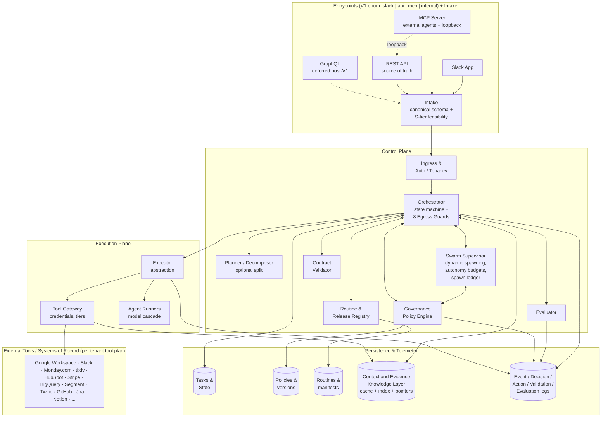
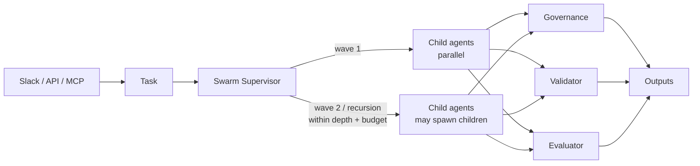

# Agentic Mesh Reference Architecture

A documentation-first reference architecture for an **agentic mesh**: a control plane that lets humans and external agents submit goals, decomposes them into governed tasks, executes them through typed tools, evaluates the outputs, and persists reusable routines.

This repository contains **no runnable code**. It is a specification intended to be:

- Read by humans (architects, platform engineers, product owners).
- Ingested by coding agents (Claude Code, Codex, Cursor, Gemini, Aider) that will implement the system in a separate code repository.

---

## 1. What problem does the mesh solve?

Most "agent platforms" today are one of two extremes:

1. A single monolithic agent with a giant tool box and no governance.
2. A workflow engine where humans hand-author every step, defeating the point of agents.

The mesh is the middle path:

- **Goals in, audited outcomes out.** Users state intent; the mesh plans, validates, executes, and evaluates.
- **Governance is first-class.** Policies are persisted objects, versioned, enforced either deterministically or by an agent, and can be authored in natural language.
- **The orchestrator is the source of truth.** State transitions live in one place; executors and agents are stateless workers.
- **Dynamic spawning is contractual.** A **Swarm Supervisor** decides whether to expand a plan (wave-based by default; recursive within conservative depth/budget/risk limits) and writes every expansion to an append-only spawn ledger. Temporal or another durable-workflow engine is an implementation candidate for the control loop, not the agent SDK itself.
- **LLM-first reasoning, deterministic verification at the egress boundary.** Agents reason against a tenant-scoped **Context and Evidence Knowledge Layer** (cache + index + evidence pointers — *not* a system of record). Every claim that surfaces to a human or writes to a system of record passes **eight deterministic egress guards** before the Tool Gateway is invoked: schema, claim-evidence map, evidence resolvability, freshness, source authority, tenancy, tier-and-policy, budget. Mid-stream "double-check" loops inside an LLM are forbidden — verification happens once, at the boundary, with the audit chain attached.
- **Routines are data, not code.** Successful task patterns are captured as DB objects with manifests. Operations (`create`, `recall`, `update`, `pin`, `copy`, `deprecate`, `archive`, `prune`) are separate from version status (`draft`, `candidate`, `active`, `deprecated`, `archived`, `pruned`); pinning is a scoped binding, not a status.
- **Evaluator catches "wrong but schema-valid".** Schemas check shape; evaluator checks meaning; egress guards check verifiability against the system of record.

---

## 2. V1 scope (what we are dogfooding first)

Three end-to-end workflows, plus four cross-cutting scenarios:

| # | Workflow | Entrypoint | External tools |
|---|----------|------------|----------------|
| 1 | Create a Monday.com task from a tl;dv recording | Slack slash command | tl;dv, Monday.com |
| 2 | Extract a Slack artifact into a Google Sheet, return the artifact link | Slack message action | Google Drive, Google Sheets |
| 3 | Review a Monday.com task and emit a grounded Slack response | Slack slash command | Monday.com, Slack |

Plus the following must be demonstrable on top of those workflows:

- **Governance violation requiring HITL.** A policy fires; the task pauses; a human approves or denies in Slack.
- **Drift / version-control scenario.** A routine or policy changes mid-flight on a long-running task; side-by-side versioning resolves it.
- **Persistent routine lifecycle.** Recall, update, pin, copy a routine across runs.
- **Duplicate garbage collection.** A near-identical request inside 15 minutes triggers confirmation; after confirmation it is suppressed for 24h.

V1 does **not** include: a web UI, a public marketplace of routines, fine-tuning, or multi-region failover.

---

## 3. Principles

1. **The Task contract is the bus.** Everything that crosses a boundary is a Task or a child of one.
2. **API is the source of truth.** Slack and MCP are interaction clients on top of the API.
3. **Orchestrator owns state.** Executors are idempotent workers; agents are stateless reasoners.
4. **Policies persist; criteria propose.** Governance policies are durable. Evaluator-generated criteria are proposals until a human or policy accepts them.
5. **Cheapest model that suffices.** Cascade from small models (classify, extract, lookup) to large models (plan, govern, evaluate, compare versions).
6. **Credentials never reach agents.** Tools are invoked through a gateway/executor that holds credentials per tenant.
7. **Generic core, client-specific tool packs.** The core mesh is reusable; per-client packs add Monday.com, HubSpot, etc.
8. **Observability is non-negotiable.** Every decision, action, validation, evaluation, and egress check is logged with provenance.
9. **LLM-first verification with deterministic guards.** LLMs do the cheap, fast reasoning. Eight deterministic guards do the expensive, checkable verification — exactly once, at the egress boundary. The Knowledge Layer caches and indexes; the systems of record stay authoritative. No mid-stream "let me double-check" loops inside an LLM.

---

## 4. Architecture (one picture)



### 4.1 Dynamic spawning (wave-based, optionally recursive)

The Swarm Supervisor expands a Task into waves of child agents, and — within conservative
recursion limits — those children may spawn their own children. Every expansion goes
through the supervisor's policy / budget / risk gate before any child runs, and is
recorded in the spawn ledger. See [docs/swarm-supervisor.md](docs/swarm-supervisor.md).



Temporal (or any other durable-workflow engine) is a reasonable **implementation
candidate** for the supervisor's control loop. The supervisor itself is a contract, not
an agent SDK.

---

## 5. Repository map

```
.
├── README.md                       # this file
├── CHANGELOG.md                    # release notes
├── AGENTS.md                       # instructions for coding agents (Claude Code, Codex, Cursor, Gemini)
├── docs/
│   ├── architecture.md             # full control-plane / execution-plane breakdown
│   ├── task-contract.md            # the canonical Task object and its lifecycle
│   ├── intake.md                   # canonical input contract + S-tier feasibility check
│   ├── knowledge-layer.md          # tenant-scoped context/evidence cache + eight egress guards
│   ├── governance.md               # policies, authoring, enforcement, HITL
│   ├── evaluator.md                # evaluation criteria, proposal-to-accept flow
│   ├── orchestration.md            # state transitions, retries, waves, recursion semantics, egress guards, kill switch
│   ├── swarm-supervisor.md         # contractual dynamic spawning, autonomy budgets, spawn ledger
│   ├── versioning.md               # git-tagged platform vs DB-persisted routines, candidate lifecycle, release manifests
│   ├── tool-plans.md               # tool trust tiers, credentials, freshness TTL, source authority, per-client packs
│   ├── v1-dogfood-scenarios.md     # the three workflows + cross-cutting scenarios
│   └── operations.md               # logging, monitoring, GC of candidates/archives, kill switch, DLQ, egress signals
├── examples/
│   ├── task.example.json           # a populated Task object
│   ├── policy.example.yaml         # a governance policy with evaluator options
│   ├── routine.example.yaml        # a persisted routine + pin binding
│   ├── criterion.example.yaml      # a proposed evaluator criterion
│   ├── hitl-decision.example.json  # a human approval record
│   ├── logs.example.json           # one entry per log stream
│   ├── dedup-fingerprint.example.json
│   ├── release-manifest.example.yaml
│   ├── tool-plan.example.yaml
│   ├── autonomy-policy.example.yaml # conservative autonomy budget defaults
│   ├── spawn-ledger.example.json   # one row of the spawn ledger
│   ├── intake.example.json         # a canonical intake artifact
│   ├── claim-evidence-map.example.json # a claim-evidence sidecar
│   ├── knowledge-layer-read.example.json # one read against the Knowledge Layer
│   └── egress-check.example.json   # the eight-guard egress check record
└── docs/proposals/                 # short proposals for cross-cutting changes
```

---

## 6. Quickstart (for readers)

Read in this order if you are new:

1. `README.md` — you are here.
2. `docs/architecture.md` — how the pieces fit.
3. `docs/task-contract.md` — the one object you must understand.
4. `docs/intake.md`, `docs/knowledge-layer.md` — how the input contract is formed and how claims stay verifiable.
5. `docs/v1-dogfood-scenarios.md` — what we are building first.
6. `docs/governance.md`, `docs/evaluator.md` — the two layers that make this safe.
7. `docs/orchestration.md`, `docs/swarm-supervisor.md`, `docs/versioning.md` — how it stays correct under change.
8. `docs/tool-plans.md`, `docs/operations.md` — how it stays correct under load.
9. `examples/` — concrete shapes.

For coding agents implementing the system, start at `AGENTS.md`.

---

## 7. Status

This is **v0.1.3**, a documentation-only patch introducing the **Context and Evidence
Knowledge Layer** (tenant-scoped cache + index + evidence-pointer; *not* a system of
record), the **Intake** layer (canonical input contract + S-tier feasibility check),
and the **eight deterministic egress guards** that run inside the Orchestrator at the
`pre_egress` trigger phase. Adds optional `intake_id`, `correlation_id`, and
`claim_evidence_map_ref` fields to the Task contract (no required fields, no new
lifecycle states, no new entrypoint enum values, no new trust tiers). No code is
included. See `CHANGELOG.md`.
