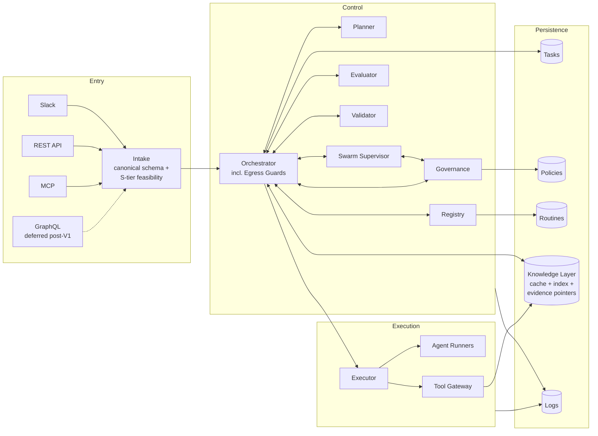
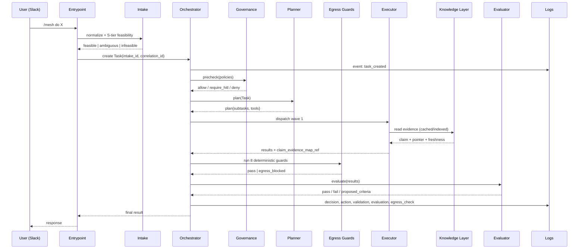

# Architecture

This document describes the agentic mesh in full. Other docs go deeper on specific pieces.

---

## 1. Planes

The mesh has four planes:

| Plane | Purpose | Key components |
|-------|---------|----------------|
| **Entry** | Receive intent from humans or other agents and form the input contract | Slack app, REST API, MCP server, **Intake** (canonical schema + S-tier feasibility check); GraphQL is a deferred future entrypoint |
| **Control** | Decide *what* should happen and *whether* it is allowed | Orchestrator (including the **Egress Guards** §3.7), Planner/Decomposer, **Swarm Supervisor**, Governance, Evaluator, Contract Validator, Routine & Release Registry |
| **Execution** | Do the work | Executor abstraction, Agent runners (model cascade), Tool Gateway |
| **Persistence & Telemetry** | Durable state, evidence, and observability | Task store, Policy store, Routine store, **Context and Evidence Knowledge Layer**, Log streams |



---

## 2. Entrypoints

### 2.1 V1 entrypoint enum

The canonical `entrypoint` enum in V1 is exactly:

```
slack | api | mcp | internal
```

| Entrypoint | Role | When to use | Notes |
|------------|------|-------------|-------|
| **`slack`** | Primary human interaction client | Slash commands, message actions, threaded approvals | Slack is a client of `api`; not a source of truth. |
| **`api`** | Command/control surface — the source of truth | Programmatic access, internal services, Slack and MCP both depend on it | REST, stable, versioned, OpenAPI-described. The *only* write surface. |
| **`mcp`** | External-agent interface and loopback | Other agents invoke the mesh; the mesh can also invoke *itself* via MCP for recursive sub-tasks | Loopback is useful for testing mesh-to-mesh and for letting an in-mesh agent reuse the same governed surface. |
| **`internal`** | Tasks not originating from a user-facing entrypoint | Scheduled jobs, child Tasks created by parents, replay-derived Tasks | Always carries a non-human `actor` and a provenance pointer to whatever created it. |

### 2.2 Deferred entrypoints

| Future entrypoint | Why deferred | Earliest target |
|-------------------|--------------|------------------|
| `graphql` | The REST API is the V1 source of truth. GraphQL is intended for complex *query* surfaces (federated dashboards, schema-driven exploration), not for command/control. Adding it before the command surface is stable would split the contract. | Post-V1, after the REST contract has been frozen for at least one release. |

In V1 documentation, examples, and code, `graphql` is **not** a legal value of `entrypoint`. Adding it requires the docs-update workflow in [AGENTS.md](../AGENTS.md).

Every entrypoint normalizes its input through **Intake** into a canonical artifact
before the Orchestrator creates a Task.

### 2.3 Intake

Intake is the thin layer between an entrypoint and the Orchestrator. It produces a
canonical input contract and runs a cheap **S-tier feasibility check**. It does not
write Task state, consult governance, or invoke tools. See [intake.md](intake.md).

The feasibility check returns `feasible`, `ambiguous`, or `infeasible` and **must not
silently escalate above the S tier**. Ambiguous requests get one disambiguating
question on the originating surface.

---

## 3. Control plane

### 3.1 Orchestrator
- Owns the Task state machine. **No other component may transition state directly.**
- Schedules waves of subtasks for parallelism.
- Coordinates retries (between waves) vs. executor retries (within a step).
- Owns idempotency keys at the Task level.
- Detects duplicate requests within a 15-minute window and asks for confirmation; after confirmation, suppresses for 24h.
- Runs the kill switch and routes poison-pill messages to a DLQ.

See [orchestration.md](orchestration.md) for full details.

### 3.2 Planner / Decomposer
- Takes a goal-shaped Task and produces a plan: a DAG of subtasks with declared tool intent, governance scope, and expected output shape.
- **Optional split:** in V1 this may be a single agent invocation inside the Orchestrator. Promotion to a standalone service is a later step when planning becomes too coupled to model upgrades.

### 3.2.1 Swarm Supervisor

- **Contractual control component** for dynamic spawning of child agents and child Tasks.
- V1 default behavior is **wave-based dynamic spawning**; recursion is enabled by
  default but constrained by a conservative `max_recursion_depth` and the autonomy
  policy in scope.
- Every spawn passes a five-step gate (policy / budget / risk / provenance / marginal
  utility) and is recorded in an append-only **spawn ledger** before the child runs.
- The supervisor never writes Task `state` (the Orchestrator does) and never invokes
  tools directly (the Executor does); its single output is the decision to spawn (or
  not) plus a ledger row.
- A durable-workflow engine such as **Temporal** is a reasonable implementation
  candidate for the supervisor's control loop. The supervisor is the *contract* —
  Temporal (or any other engine) is one possible implementation. Temporal is **not**
  itself the agent SDK.

See [swarm-supervisor.md](swarm-supervisor.md) for the spawn gate, ledger fields,
recursion semantics, HITL escalation triggers, and kill-switch behavior for runaway
swarms.

### 3.3 Governance / Policy Engine
- Policies live in the Policy store, are durable, versioned, and identified.
- Enforcement is either:
  - **Deterministic** — schema-checkable rule evaluated as code.
  - **Agentic** — an LLM-based judge invoked with the policy text and the Task context.
- Pauses the Task and emits an HITL request when a policy demands review.

See [governance.md](governance.md).

### 3.4 Evaluator
- Produces evaluation results against criteria.
- Catches "wrong but schema-valid" outputs (e.g. correctly typed JSON pointing at the wrong row).
- May *propose* new criteria; proposals are not active until accepted by a human or by a policy that authorizes auto-acceptance.
- Accepted criteria are versioned alongside their owning routine/policy/release.

See [evaluator.md](evaluator.md).

### 3.5 Contract Validator
- Validates inputs and outputs of every Task transition against the Task contract.
- Cheap, deterministic, runs everywhere. Different from the Evaluator — validator checks **shape**, evaluator checks **meaning**.

### 3.6 Routine & Release Registry
- Stores DB-persisted routines (reusable execution patterns).
- Stores release manifests pinning the precise versions of policy, prompt, runner/routine, tool plan, contract, and evaluator criteria/suites.

See [versioning.md](versioning.md).

### 3.7 Egress Guards (inside the Orchestrator)
- Eight **deterministic** guards that every proposed egress passes before the Tool
  Gateway is invoked or a human-facing output is surfaced.
- Guards in order: schema, claim-evidence map, evidence resolvability, freshness,
  source authority, tenancy, tier-and-policy, budget.
- None of the guards invokes an LLM. The Evaluator (meaning) and Contract Validator
  (shape) remain unchanged; the egress guards are a third, deterministic boundary
  that runs at the **`pre_egress`** trigger phase (see [governance.md §2.1](governance.md)).
- A failing guard emits a `decision_kind: egress_blocked` Decision log entry and may
  trigger `require_hitl` per the active policy.

See [knowledge-layer.md §5](knowledge-layer.md).

---

## 4. Execution plane

### 4.1 Executor abstraction
- Single interface used by the Orchestrator to dispatch a step.
- Implementations may be: an Agent Runner, a deterministic tool call, a sub-Task invocation, or a wait-for-HITL.
- Each implementation is responsible for **step-local retries and idempotency** of side effects it owns.

### 4.2 Agent Runners (model cascade)
| Tier | Typical use |
|------|-------------|
| **S** (smallest) | Classification, intent detection, field extraction, simple status checks, duplicate-similarity scoring |
| **M** (mid) | Most workflow steps, lookups, summarization, response formatting |
| **L** (large) | Planning under ambiguity, policy compilation from natural-language, version comparison, evaluation, incident root-cause analysis, governance edge cases |

The runner records which tier was used and why, so cost and quality can be audited.

### 4.3 Tool Gateway
- The **only** place credentials live.
- Resolves a `(tenant_id, tool_id)` to a credentialed client at call time.
- Enforces tool **trust tiers** (`read_safe`, `read_sensitive`, `write_revocable`, `write_destructive`, `external_egress`) — see [tool-plans.md](tool-plans.md).
- Emits an Action log entry for every call.

---

## 5. Persistence & telemetry

### 5.1 Context and Evidence Knowledge Layer

A tenant-scoped cache, index, and **evidence-pointer** layer that grounds agent
reasoning in checkable references. **It is not a system of record** — ground truth
remains in the source systems (Monday.com, Drive, Slack, HubSpot, Stripe, BigQuery,
tl;dv, etc.). LLM agents never write to it directly; writes are a byproduct of tool
calls that passed the eight deterministic egress guards (§3.7).

See [knowledge-layer.md](knowledge-layer.md).

### 5.2 Log streams

Five log streams. Together they form the audit chain:

| Log | Captures |
|-----|----------|
| **Event log** | External or internal triggers entering the mesh (Slack message, MCP call, API request, cron, completion of a child Task). |
| **Decision log** | Choices made by the Orchestrator, Planner, or an agentic policy: "selected routine X", "denied by policy Y", "accepted criterion Z". |
| **Action log** | Side-effecting tool calls executed via the Gateway, including the tier and credential alias used (never the secret). |
| **Validation log** | Contract validator runs and their results. |
| **Evaluation log** | Evaluator outputs and accepted/proposed criteria. |

Each entry carries: `tenant_id`, `task_id`, `actor`, `entrypoint`, `timestamp`, `release_manifest_id`, `reason`, and where applicable a `recommended_action`. This is what powers the no-frontend monitoring story (see [operations.md](operations.md)).

---

## 6. Multi-tenant & generic-vs-client-specific

- The **core mesh** is tenant-agnostic.
- Each tenant has a **tool plan** that declares which tools are present, at which trust tier, with which credentials.
- Client-specific behavior is expressed as a pack of: tool plan, policies, routines, and optionally evaluator criteria.
- Defaults present in every tenant: **MCP Gateway**, **Google Workspace**, **Slack**.
- Common extensions: Monday.com, tl;dv, HubSpot, Stripe, BigQuery, Segment, Twilio, GitHub, Jira, Notion.

---

## 7. End-to-end flow (read-once mental model)



---

## 8. Pending / deferred

- GraphQL entrypoint.
- Marketplace for routines across tenants.
- Multi-region orchestration.
- Native fine-tuning loop (the evaluator's accepted criteria are the substrate when that becomes interesting).
