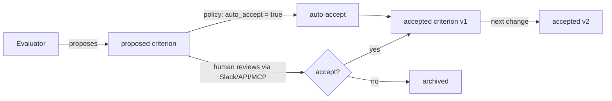

# Evaluator

The Evaluator answers a single question for every Task or wave: **did this actually do
what it claimed to do?** The Contract Validator already checks that the output has the
right *shape*. The Evaluator checks that the output has the right *meaning*.

---

## 1. Why a separate component

Schema-valid does not mean correct. Examples of bugs the Evaluator catches:

- A "Monday.com task created" result whose `item_id` exists — but in the wrong board.
- A Google Sheet extraction that yields a perfectly formatted sheet — using the wrong source file.
- A grounded Slack response that quotes the right shape of citation — pointing at the wrong record.

Each of these passes the contract. None of them is what the user asked for.

---

## 2. What the Evaluator produces

For each evaluation pass it emits:

| Field | Description |
|-------|-------------|
| `evaluation_id` | Unique ID. |
| `task_id`, `wave_index` | Subject. |
| `criteria_version` | The versioned criteria suite run. |
| `criterion_results[]` | Per-criterion result: `pass`, `fail`, `unknown`, plus a justification. |
| `metrics[]` | Numeric metrics (similarity scores, confidence, latency, cost). |
| `verdict` | Aggregate `pass`, `fail`, `degraded`. |
| `proposed_criteria[]` | New criteria the Evaluator suggests adding, each with rationale. Always `status: proposed`. |
| `model_tier` | The cascade tier used (usually **L**). |
| `provenance` | Inputs, the routine version, the release manifest, and the data sampled. |

A `degraded` verdict means the output is acceptable but the Evaluator wants attention; it does not block.

---

## 3. Criteria

A **criterion** is the unit of evaluation:

| Field | Description |
|-------|-------------|
| `criterion_id`, `version` | Identity. |
| `intent` | What this criterion is checking, in plain English. |
| `applies_to` | Routine ID(s), policy ID(s), or `release_manifest_id` scope. |
| `kind` | `assertion`, `metric`, `judge` (LLM-based). |
| `spec` | The deterministic predicate, the metric formula, or the judge prompt. |
| `status` | `proposed`, `accepted`, `deprecated`, `archived`. |
| `accepted_by` | Human ID, or `policy:<policy_id>` if auto-accepted. |
| `provenance` | Where it came from: human-authored, Evaluator-proposed, derived from incident. |

Criteria are stored next to the routine or release they apply to, but they are
**first-class versioned objects** — they outlive any single Task.

---

## 4. Proposal-to-accept flow

The Evaluator's superpower is that it can spot a gap in its own coverage:

> "I noticed the task asserted `monday_item_id` exists, but did not assert it lives on the board the user named. Propose new criterion."

That proposal is **not active** until accepted.

Acceptance options:

1. **Human acceptance** via the surface the proposal arrived on (typically Slack, optionally API/MCP). The accepting actor, timestamp, and reason are recorded.
2. **Policy-driven auto-accept.** A governance policy may declare `auto_accept_evaluator_criteria: true` for a specific routine or scope (typically used for high-volume low-risk routines where reviewer fatigue would otherwise dominate).

Accepted criteria are versioned and become part of the next **release manifest** that references the routine/policy in question — see [versioning.md](versioning.md).

---

## 5. When the Evaluator runs

| Trigger | Purpose |
|---------|---------|
| After every wave | Catch wave-local errors before the next wave consumes them. |
| Before terminal success | Final pass against the full criteria suite. |
| On-demand from a policy | A governance policy may demand evaluation at additional checkpoints. |
| Replay | Run accepted criteria against historical Tasks to validate a new version. |

---

## 6. Relationship to the contract validator

| Concern | Validator | Evaluator |
|---------|-----------|-----------|
| Shape | yes | no |
| Required fields present | yes | no |
| Field values *correct in context* | no | yes |
| Cost | very low | high (often **L** tier) |
| Failure semantics | revert state | flag `fail` / `degraded` |
| Runs always | yes | once per wave + once at end |

Both run on every Task. They are not substitutes.

---

## 7. What the Evaluator is **not**

- Not a policy. Criteria do not block tool access; policies do.
- Not a benchmark suite. It evaluates real production Tasks, not synthetic prompts.
- Not optional in V1. The dogfood scenarios depend on it to catch wrong-but-schema-valid outputs (see [v1-dogfood-scenarios.md](v1-dogfood-scenarios.md)).
