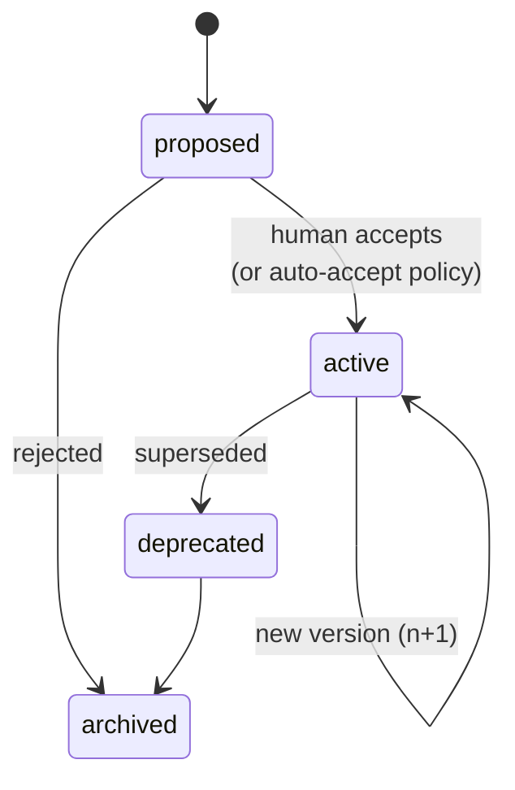
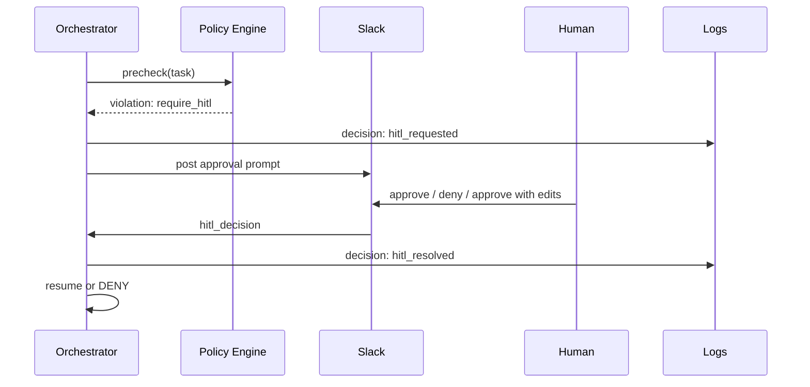

# Governance

Governance is the layer that decides whether a Task — or a step inside one — is **allowed**
to proceed, and under what conditions. It is durable, versioned, and authored by humans
in a form they can read.

---

## 1. What a policy is

A **policy** is a persisted object with:

| Field | Description |
|-------|-------------|
| `policy_id` | Stable identifier. |
| `version` | Monotonic version. Each accepted change creates a new version. |
| `tenant_scope` | A tenant ID, a tenant group, or `global`. |
| `title` | Human-readable title. |
| `intent` | Natural-language description of what the policy is protecting. |
| `enforcement_mode` | `deterministic`, `agentic`, or `hybrid`. |
| `rule` | The deterministic rule (if applicable): a structured predicate over Task fields, tool calls, or evaluator results. |
| `agent_prompt` | The prompt and criteria given to an LLM judge (if agentic or hybrid). |
| `triggers` | When the policy fires: `on_task_create`, `on_plan`, `pre_tool_call`, `pre_egress`, `post_evaluation`, etc. |
| `on_violation` | What to do: `deny`, `require_hitl`, `downgrade_tier`, `route_to_routine`, `log_only`. |
| `provenance` | Authored-by (human or evaluator-proposed), source document, prior version. |
| `created_at`, `accepted_at`, `deprecated_at` | ISO timestamps. |
| `status` | `proposed`, `active`, `deprecated`, `archived`. |

A concrete shape is in [`examples/policy.example.yaml`](../examples/policy.example.yaml).

---

## 2. How policies are authored

Policies can enter the system three ways:

1. **API.** Direct structured upload (YAML/JSON) — typical for platform engineers.
2. **Slack.** A natural-language message in a designated channel: *"Never send Stripe data to BigQuery without a written request from finance."* The mesh compiles this into a policy proposal (status: `proposed`). A human reviewer accepts and it becomes `active`.
3. **Uploaded document.** A PDF / Markdown / Google Doc of the company's SOP. The mesh extracts policy candidates from the document, each as a `proposed` policy. A human reviewer accepts them individually.

The compilation step in (2) and (3) is itself a Task — it has provenance, is logged, and uses a large-tier model because policy authoring is high-stakes and ambiguous.

---

## 3. Deterministic vs agentic enforcement

| Mode | What runs | When to use |
|------|-----------|-------------|
| **Deterministic** | A schema-checkable predicate (e.g. `tool.tier > read_safe AND tenant.region == 'eu'`) | When the rule is exact, hot-path, and fast. Most "you can't call X without Y" rules. |
| **Agentic** | An LLM judge invoked with policy text and Task context | When the rule depends on intent or natural-language nuance (e.g. "we shouldn't book external dependencies in customer-facing copy"). |
| **Hybrid** | Deterministic prefilter, agentic only on near-misses | Default for ambiguous policies with a hot path. |

Agentic enforcement uses the **L** model tier. Deterministic uses no LLM. Hybrid uses **S/M** for prefilter, **L** only on escalation.

---

## 4. Lifecycle

- Policies are **never deleted**. `archived` is the floor.
- A new version of an active policy creates a new row; the previous version is `deprecated` immediately but still resolvable by past Tasks via their `release_manifest_id`.

---

## 5. Persistence guarantees

- Policies persist **indefinitely**. There is no TTL.
- A Task's `release_manifest_id` pins the exact policy versions in effect at creation time. A policy change mid-flight does **not** silently apply.
- A long-running Task may opt in to live-policy updates only via the side-by-side versioning flow in [orchestration.md](orchestration.md).

---

## 6. HITL flow

When `on_violation = require_hitl`:

1. Orchestrator transitions the Task to `AWAITING_HITL`.
2. A notification is sent to the policy's configured channel (Slack channel, API webhook, MCP subscriber).
3. The notification carries: actor, entrypoint, timestamp, policy ID + version, reason, and a **recommended action**.
4. An approver responds via the same channel; the response becomes a `hitl_decision` provenance entry.
5. Orchestrator resumes the Task or transitions it to `DENIED`.

A worked example is in [v1-dogfood-scenarios.md §5](v1-dogfood-scenarios.md).

---

## 7. Relationship to the Evaluator

The Evaluator may *propose* new criteria. A criterion is not a policy — it lives next to a routine or release. However:

- A policy can declare `auto_accept_evaluator_criteria: true` for a specific routine or scope. In that case, proposed criteria become active without HITL.
- Otherwise, criteria proposals enter the same review surface as policy proposals.

See [evaluator.md](evaluator.md).

---

## 8. What governance is **not**

- It is not a workflow engine. Policies do not decide *what* to do; they decide *whether*.
- It is not a rate limiter. Quotas live in the Tool Gateway.
- It is not the validator. Schema correctness lives in the Contract Validator.
- It is not the evaluator. Output quality lives in the Evaluator.
