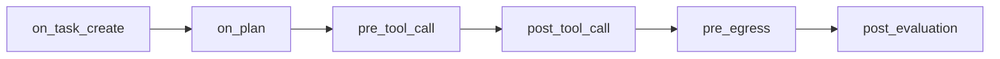
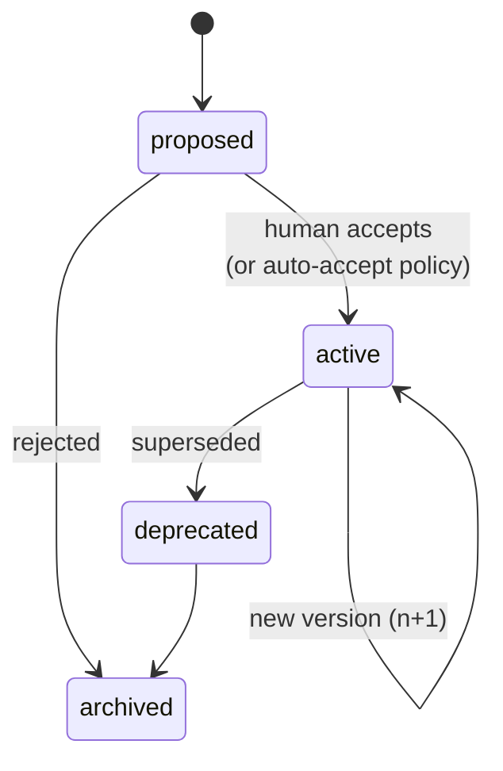
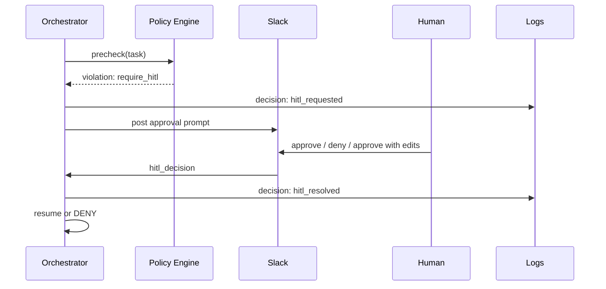
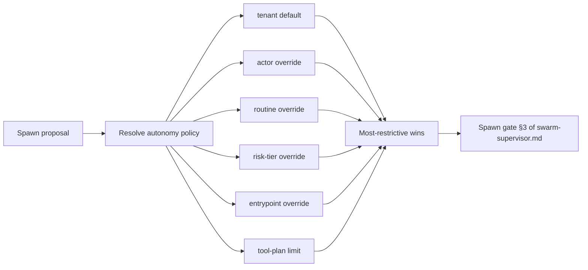

# Governance

Governance is the layer that decides whether a Task — or a step inside one — is **allowed**
to proceed, and under what conditions. It is durable, versioned, and authored by humans
in a form they can read.

---

## 1. What a policy is

A **policy** is a persisted object with:

| Field | Description |
|-------|-------------|
| `policy_id` | Stable identifier. |
| `version` | Monotonic version. Each accepted change creates a new version. |
| `tenant_scope` | A tenant ID, a tenant group, or `global`. |
| `title` | Human-readable title. |
| `intent` | Natural-language description of what the policy is protecting. |
| `enforcement_mode` | `deterministic`, `agentic`, or `hybrid`. |
| `rule` | The deterministic rule (if applicable): a structured predicate over Task fields, tool calls, or evaluator results. |
| `agent_prompt` | The prompt and criteria given to an LLM judge (if agentic or hybrid). |
| `triggers` | When the policy fires: `on_task_create`, `on_plan`, `pre_tool_call`, `pre_egress`, `post_evaluation`, etc. |
| `on_violation` | What to do: `deny`, `require_hitl`, `downgrade_tier`, `route_to_routine`, `log_only`. |
| `provenance` | Authored-by (human or evaluator-proposed), source document, prior version. |
| `created_at`, `accepted_at`, `deprecated_at` | ISO timestamps. |
| `status` | `proposed`, `active`, `deprecated`, `archived`. |

A concrete shape is in [`examples/policy.example.yaml`](../examples/policy.example.yaml).

---

## 2. How policies are authored

Policies can enter the system three ways:

1. **API.** Direct structured upload (YAML/JSON) — typical for platform engineers.
2. **Slack.** A natural-language message in a designated channel: *"Never send Stripe data to BigQuery without a written request from finance."* The mesh compiles this into a policy proposal (status: `proposed`). A human reviewer accepts and it becomes `active`.
3. **Uploaded document.** A PDF / Markdown / Google Doc of the company's SOP. The mesh extracts policy candidates from the document, each as a `proposed` policy. A human reviewer accepts them individually.

The compilation step in (2) and (3) is itself a Task — it has provenance, is logged, and uses a large-tier model because policy authoring is high-stakes and ambiguous.

### 2.1 Policy trigger phases

Where a policy fires over the Task lifecycle:



A single policy can declare multiple `triggers`. `pre_tool_call` and `pre_egress` are the
two most common gates that fire `require_hitl`; `post_evaluation` is where policies
that depend on evaluator verdicts (or that auto-accept evaluator criteria) attach.

The **`pre_egress`** trigger phase is where the eight deterministic **egress guards**
(see [knowledge-layer.md §5](knowledge-layer.md)) run. The guards run *before* any
agentic `pre_egress` policy: cheap deterministic checks first, expensive agentic
enforcement only on near-misses. A failing deterministic guard surfaces as a
`decision_kind: egress_blocked` Decision log entry and, depending on the guard, may
trigger `require_hitl` via the same flow described in §6.

---

## 3. Deterministic vs agentic enforcement

| Mode | What runs | When to use |
|------|-----------|-------------|
| **Deterministic** | A schema-checkable predicate using **set membership** over the trust-tier enum (e.g. `tool.tier in {"write_revocable", "write_destructive"} AND tenant.region == "eu"`) | When the rule is exact, hot-path, and fast. Most "you can't call X without Y" rules. |
| **Agentic** | An LLM judge invoked with policy text and Task context | When the rule depends on intent or natural-language nuance (e.g. "we shouldn't book external dependencies in customer-facing copy"). |
| **Hybrid** | Deterministic prefilter, agentic only on near-misses | Default for ambiguous policies with a hot path. |

Agentic enforcement uses the **L** model tier. Deterministic uses no LLM. Hybrid uses **S/M** for prefilter, **L** only on escalation.

**Trust tiers are an unordered enum, not an ordinal scale.** Policies must use set
membership (`in`, `not in`) rather than comparison operators. Writing `tool.tier >
read_safe` is undefined behavior. See [tool-plans.md §1](tool-plans.md) for the tier
list.

---

## 4. Lifecycle



- Policies are **never deleted**. `archived` is the floor.
- A new version of an active policy creates a new row; the previous version is `deprecated` immediately but still resolvable by past Tasks via their `release_manifest_id`.

---

## 5. Persistence guarantees

- Policies persist **indefinitely**. There is no TTL.
- A Task's `release_manifest_id` pins the exact policy versions in effect at creation time. A policy change mid-flight does **not** silently apply.
- A long-running Task may opt in to live-policy updates only via the side-by-side versioning flow in [orchestration.md](orchestration.md).

---

## 6. HITL flow

When `on_violation = require_hitl`:

1. Orchestrator transitions the Task to `AWAITING_HITL`, recording `hitl.from_state` (the state the gate fired from — `POLICY_CHECK`, `EVALUATING`, or **`EGRESS_CHECK`** when a deterministic egress guard or an agentic `pre_egress` policy escalates; see [knowledge-layer.md §5](knowledge-layer.md)).
2. A notification is sent to the policy's configured channel (Slack channel, API webhook, MCP subscriber).
3. The notification carries: actor, entrypoint, timestamp, policy ID + version, reason, and a **recommended action**.
4. An approver responds via the same channel; the response becomes a `hitl_decision` provenance entry.
5. On **approve**: Orchestrator resumes the Task to `hitl.from_state`. For `EGRESS_CHECK`, resume re-runs the failing guard (and any deterministic guards after it) before the Tool Gateway is invoked. On **deny**: Orchestrator transitions the Task to `DENIED`.

`EGRESS_CHECK` is a sub-phase of `EXECUTING`, not a new top-level Task state — see
[task-contract.md §3](task-contract.md) transition rule 6.

A concrete decision record is in [`examples/hitl-decision.example.json`](../examples/hitl-decision.example.json).



A worked example is in [v1-dogfood-scenarios.md §5](v1-dogfood-scenarios.md).

---

## 7. Relationship to the Evaluator

The Evaluator may *propose* new criteria. A criterion is not a policy — it lives next to a routine or release.

**Rule.** Evaluator-generated criteria are written as `candidate` review records and remain
proposals until either (a) a human accepts them, or (b) a policy with
`auto_accept_evaluator_criteria: true` authorizes auto-acceptance for the criterion's
scope. On acceptance, the criterion is versioned (`v1`) and reused via release manifests.
A Task is **not paused** by criterion proposals — see [task-contract.md §2.1](task-contract.md).

A policy that authorizes auto-acceptance carries an `evaluator_options` block:

```yaml
evaluator_options:
  auto_accept_criteria: true        # canonical name; alias of auto_accept_evaluator_criteria
  scope:
    routine_refs: [rt_tldv_to_monday]
    severity_at_most: degraded      # only auto-accept criteria whose worst observed verdict is `degraded`
```

The legacy spelling `auto_accept_evaluator_criteria` remains a recognized alias. Use
`evaluator_options.auto_accept_criteria` in new examples for consistency.

See [evaluator.md](evaluator.md) and [`examples/policy.example.yaml`](../examples/policy.example.yaml).

---

## 8. Autonomy policies

Governance also bounds **how much autonomy** a Task is allowed when the Swarm
Supervisor proposes dynamic spawning or recursion. An autonomy policy is a regular
policy (same fields as §1) whose `rule` carries an `autonomy_budget` block.

| Field | Meaning |
|-------|---------|
| `max_waves` | Maximum number of waves the supervisor may schedule for a Task. |
| `max_child_agents_per_wave` | Maximum sibling subtasks in a single wave. |
| `recursion_enabled` | Boolean. If `false`, no child Task may spawn its own children. |
| `max_recursion_depth` | Integer. Caps `depth + 1` for any spawn. V1 default is `1`. |
| `max_wall_clock_minutes` | Wall-clock budget across the whole Task tree. |
| `max_tool_calls` | Total tool calls (any tier) across the whole tree. |
| `max_model_calls` | Total agent invocations across the whole tree. |
| `max_token_budget` | Total tokens (prompt + completion) across the whole tree. |
| `external_write_tier_limit` | The highest trust tier (set-membership ceiling) the supervisor may spawn into without HITL — e.g. `{read_safe, read_sensitive, write_revocable}`. |
| `auto_candidate_creation_allowed` | Whether the supervisor may persist a candidate routine/criterion at the end of a successful expansion without HITL. Defaults to `true` for low-risk routines; review remains non-blocking (see [versioning.md §4.3](versioning.md)). |
| `min_confidence_to_spawn` | Minimum self-reported confidence required from the spawning agent before the supervisor will dispatch the child. |
| `evidence_fetch_budget` | Caps on Knowledge Layer reads, refetches against systems of record, and mid-stream stale-acceptance count. Three sub-fields: `max_reads`, `max_refetches`, `max_stale_acceptance`. Egress guard 8 (budget) fails when a proposed call would breach any of them. See [knowledge-layer.md §7](knowledge-layer.md). |

Autonomy policies can **lower or raise** any limit by any of these scopes:

- **Task type** — declared in the routine or inferred from `goal`.
- **Tenant** — per-tenant ceilings; a tenant may permit deeper recursion than another.
- **Actor** — per-user or per-agent ceilings (a junior internal agent gets a smaller
  budget than a trusted service account).
- **Risk tier** — risk-tier-based ceilings (e.g. high-risk routines are capped harder).
- **Entrypoint** — Slack-originated work may be capped differently from API-originated
  work.
- **Routine** — per-routine overrides on top of the tenant default.
- **Tool plan** — a tool plan that lacks certain tiers automatically lowers the
  effective `external_write_tier_limit`.

When multiple scopes apply to a single Task, the **most restrictive** value wins for
each field. Resolution is deterministic and logged in the Decision log under
`decision_kind: autonomy_budget_resolved` so the operator can see which scope clamped
which field.



See [swarm-supervisor.md](swarm-supervisor.md) for how the supervisor consumes these
fields and [orchestration.md §3.2](orchestration.md) for the V1 defaults.

---

## 9. What governance is **not**

- It is not a workflow engine. Policies do not decide *what* to do; they decide *whether*.
- It is not a rate limiter. Quotas live in the Tool Gateway.
- It is not the validator. Schema correctness lives in the Contract Validator.
- It is not the evaluator. Output quality lives in the Evaluator.
