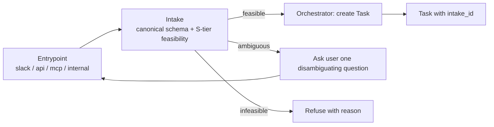

# Intake

**Intake** is the very first thing that happens after an entrypoint accepts a request
and before the Orchestrator creates a Task. It produces a canonical, schema-checked
**input contract** plus a cheap **S-tier feasibility check**.

The input contract for the rest of the mesh is **formed at intake**, not inside a
running Task. Everything downstream — Planner, Swarm Supervisor, Governance, the
Knowledge Layer, the egress guards — reads against the intake artifact.

---

## 1. Canonical intake schema

Every entrypoint (Slack, API, MCP, internal) normalizes its incoming request into a
single intake artifact before the Orchestrator does anything else.

| Field | Required | Description |
|-------|----------|-------------|
| `intake_id` | yes | ULID. The stable id of this intake artifact. |
| `tenant_id` | yes | Tenant scope. Every intake is tenant-scoped. |
| `entrypoint` | yes | One of `slack`, `api`, `mcp`, `internal` (V1 enum). |
| `actor` | yes | Initiating identity. Same shape as `Task.actor`. |
| `goal` | yes | Natural-language intent, preserved verbatim. |
| `inputs` | yes | Structured inputs (URLs, IDs, file refs, query params). |
| `correlation_id` | no | Optional, propagated. See [knowledge-layer.md §8](knowledge-layer.md). |
| `proposed_tool_intents` | no | The S-tier classifier's guess at what tools may be needed. Not authoritative. |
| `feasibility` | yes | The S-tier feasibility check result (see §2). |
| `release_manifest_id` | yes | Pinned at intake; carried into the resulting Task. |
| `created_at` | yes | ISO-8601 UTC. |

A concrete intake artifact is in [`examples/intake.example.json`](../examples/intake.example.json).

The resulting Task references the intake artifact via the optional `intake_id` field
on the Task contract (see [task-contract.md §1](task-contract.md)).

---

## 2. The S-tier feasibility check

Intake's second job is a cheap, deterministic *plus* S-tier classification step that
answers three questions before the Orchestrator pays for anything more expensive:

1. **Is this request well-formed?** Does it parse against the entrypoint's input
   schema? Schema-only; no LLM.
2. **Does the tenant's tool plan even contain the tools this request would likely
   need?** Lookup-only against the tool plan; no LLM.
3. **Is the goal coherent enough to plan against?** A single S-tier classifier
   invocation. The output is one of `feasible`, `ambiguous`, `infeasible`.

The check produces:

```json
"feasibility": {
  "verdict": "feasible | ambiguous | infeasible",
  "reason": "...",
  "model_tier": "S",
  "checked_tools": ["tldv.fetch_transcript", "monday.items.create"]
}
```

### 2.1 Verdicts

| Verdict | Meaning | Next action |
|---------|---------|-------------|
| `feasible` | Well-formed, tools plausibly available, goal coherent. | Create Task with `intake_id`. |
| `ambiguous` | Goal is unclear or could resolve to multiple workflows. | Ask the user one disambiguating question on the originating surface; do **not** plan. |
| `infeasible` | Required tools not in the tenant's tool plan, or schema-invalid input. | Refuse at the entrypoint with a clear reason. No Task is created. |

### 2.2 No silent escalation above S-tier

The feasibility check **must not silently escalate above the S tier.** If the S-tier
classifier returns low confidence, intake emits `feasibility.verdict = ambiguous` and
asks a single disambiguating question. It does **not** invoke an M-tier or L-tier
model to "try harder".

The rationale: intake is the cheap front door. Promoting it to M or L tier under
ambiguity creates a hidden cost-and-latency tax on every request, and erodes the
"cheapest model that suffices" principle from [README.md §3](../README.md). The
expensive models reach the request when the Planner / Evaluator / governance say so —
explicitly, not via implicit fallback.

If a tenant genuinely needs richer intake reasoning, that is expressed as a
**routine** the Orchestrator dispatches *after* a feasible Task is created — not as
intake itself.

---

## 3. Where intake fits



Intake is owned by the Entry plane in [architecture.md §1](architecture.md). It is
**not** part of the control plane — it does not write Task state, does not consult
governance, and does not invoke tools. It is a thin normalizer with a single S-tier
LLM call.

---

## 4. Provenance

Intake emits one `provenance` entry on the resulting Task:

```json
{"kind": "intake", "ref": "intake_01HXYZ0001"}
```

`intake` is a new provenance kind, listed in [task-contract.md §5](task-contract.md).

---

## 5. What intake is **not**

- Not the Planner. It does not produce waves; it does not pick a routine.
- Not Governance. It does not enforce policy. (A policy may *refuse at intake* via
  the `on_task_create` trigger; the policy fires once a Task is created, not earlier.)
- Not the Knowledge Layer. It does not read or write Knowledge Layer entries; it
  only proposes tool intents the downstream Task may use.
- Not an escalation surface. An ambiguous intake produces exactly one disambiguating
  question, not an L-tier reasoning loop.
