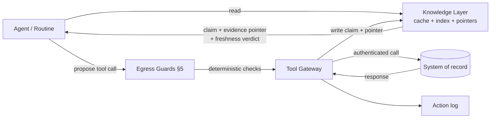
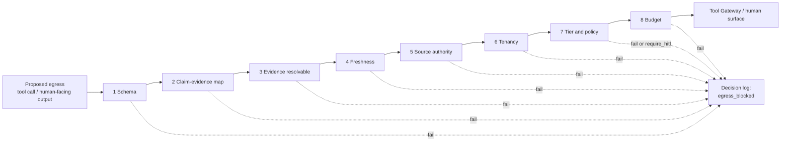

# Context and Evidence Knowledge Layer

The **Context and Evidence Knowledge Layer** (henceforth the *Knowledge Layer*) is the
tenant-scoped cache, index, and **evidence-pointer** substrate the mesh uses to ground
agent reasoning in checkable references. It is **not** a system of record.

Ground truth always lives in the **external systems of record** (Monday.com, Google
Drive, Slack, HubSpot, Stripe, BigQuery, tl;dv, etc.). The Knowledge Layer mirrors,
indexes, and points at those systems; it never replaces them.

---

## 1. What the Knowledge Layer is, and is not

| Property | Knowledge Layer | (external) Authoritative source |
|---|---|---|
| Authority | Derivative. Cached / indexed / pointer-only. | Authoritative. |
| Lifetime | Short-lived; subject to freshness TTL and eviction. | Indefinite. |
| Writes | Only via **deterministic egress guards** (see §5). Never directly by an LLM. | Owned by their respective product surfaces. |
| Reads | Cheap; tenant-scoped; served from cache/index when fresh. | Hit only when the layer is missing/stale/non-authoritative. |
| Identity | `(tenant_id, source_system, source_id)` plus a content hash. | The source system's own identifier. |

**Mental model.** The Knowledge Layer is to an agent what a router cache is to a
distributed system: an accelerator and an evidence trail, not the source.

---

## 2. Read / write / freshness / tenancy contract

### 2.1 Read contract
- Reads are keyed by `(tenant_id, source_system, source_id)` and optionally by content
  hash for diff-aware lookups.
- A read returns a **claim** (the cached/indexed value) plus an **evidence pointer**
  back to the system of record (a URL, a tool plan `tool_id` + lookup key, a stable
  external id).
- A read **must** carry a freshness verdict — `fresh`, `stale`, or `unknown` — derived
  from the entry's TTL (see [tool-plans.md §3.3](tool-plans.md)).
- A `stale` read does not block. The caller decides whether to refetch through the Tool
  Gateway against the system of record.

### 2.2 Write contract
- The Knowledge Layer is written **only** as a byproduct of a successful tool call
  that passed the eight deterministic egress guards (§5) and the standard Action-log
  flow.
- LLM agents **never** write to the Knowledge Layer directly. An agent's output reaches
  the layer only after the egress guards have validated it and the Tool Gateway has
  recorded the call.
- Writes are append-style versioned rows; in-place mutation is forbidden, consistent
  with [versioning.md §7](versioning.md).
- Each row records `is_authoritative_for[]` derived from the tool plan (see §6).

### 2.3 Freshness contract
- Every Knowledge Layer entry carries `freshness_ttl_seconds`, sourced from the
  per-tool freshness TTL declared in the tool plan (see
  [tool-plans.md §3.3](tool-plans.md)).
- An entry is `fresh` when `now < fetched_at + freshness_ttl_seconds`, `stale`
  otherwise, and `unknown` if `freshness_ttl_seconds` is unset for the tool.
- Stale entries remain readable so the audit chain is preserved; consumers must treat
  them as evidence that *was* current, not as current truth.

### 2.4 Tenancy contract
- Every entry is keyed first by `tenant_id`. Cross-tenant lookups are forbidden by
  construction, consistent with [tool-plans.md §5](tool-plans.md).
- Eviction, listing, and metrics are also tenant-scoped.



---

## 3. Claim-evidence sidecar schema

Every output an agent produces that asserts a fact about an external entity is
accompanied by a **claim-evidence sidecar**. The sidecar is a small JSON object that
maps each claim to one or more evidence pointers.

```json
{
  "claim_evidence_map_ref": "cem_01HXYZ0001",
  "tenant_id": "tenant_acme",
  "task_id": "task_01HXYZABCDEF0001",
  "correlation_id": "corr_01HXYZ0001",
  "release_manifest_id": "rm_2026_05_15_a",
  "schema_version": "knowledge-layer/v0.1.3",
  "claims": [
    {
      "claim_id": "c1",
      "subject": "monday_item:1234567890",
      "predicate": "status",
      "value": "Blocked",
      "evidence": [
        {
          "kind": "knowledge_layer_entry",
          "ref": "kl:tenant_acme:monday/items/1234567890#v17",
          "freshness": "fresh",
          "fetched_at": "2026-05-15T10:33:11Z",
          "is_authoritative_for": ["monday_item.status"]
        }
      ]
    }
  ]
}
```

A populated, illustrative sidecar is in
[`examples/claim-evidence-map.example.json`](../examples/claim-evidence-map.example.json).
A read against the Knowledge Layer is in
[`examples/knowledge-layer-read.example.json`](../examples/knowledge-layer-read.example.json).

The sidecar is referenced from a Task via the optional
`claim_evidence_map_ref` field on the Task contract (see
[task-contract.md §1](task-contract.md)).

---

## 4. Egress-only verification rule

> **Verification of a claim against the system of record happens *only* at the egress
> boundary — never mid-stream inside an LLM reasoning loop.**

This is the load-bearing rule. Mid-stream "let me double-check" calls inside an
agent are forbidden because they (a) bypass the Action log, (b) bypass the egress
guards (§5), and (c) inflate token cost without strengthening the audit chain.

Consequences:

- The agent reasons against the Knowledge Layer (cached/indexed claims with
  freshness verdicts).
- When the agent is ready to *act* — call a tool, write to an external system, or
  surface an output to a human — the egress guards run.
- The guards re-resolve evidence pointers against the system of record where the
  freshness verdict or the guard rule demands it. Refetch is logged.

This is what makes "LLM-first verification with deterministic guards" coherent: the
LLM does the cheap, fast reasoning; the deterministic guards do the expensive,
checkable verification, exactly once, at the boundary.

---

## 5. The eight deterministic egress guards

Every proposed egress — a tool call into a system of record, a write into the
Knowledge Layer that originated from an LLM-produced claim, or a human-facing output
that cites Knowledge Layer evidence — passes **eight deterministic guards** in order.
Each guard is schema-checkable; none invokes an LLM.

| # | Guard | What it checks | On failure |
|---|-------|----------------|------------|
| 1 | **Schema guard** | Output conforms to its `output_schema`. (This is the Contract Validator's existing job — surfaced here because every egress passes it.) | Revert; Validation log entry. |
| 2 | **Claim-evidence map guard** | Every claim in the output is keyed in the `claim_evidence_map_ref` sidecar. No bare claims. | Block; Decision log `egress_blocked: missing_evidence`. |
| 3 | **Evidence resolvability guard** | Every evidence pointer resolves to a Knowledge Layer entry or to a Tool Gateway lookup against the source system. | Block; Decision log `egress_blocked: unresolved_evidence`. |
| 4 | **Freshness guard** | No evidence pointer is `stale` for the proposed action. (Reads from a stale entry are allowed; *writes* and *human-surfacing outputs* that depend on stale evidence are not.) | Block; offer refetch through the Gateway; Decision log `egress_blocked: stale_evidence`. |
| 5 | **Source-authority guard** | Each cited evidence pointer's `is_authoritative_for[]` includes the predicate of the claim it backs. (E.g. you cannot cite a HubSpot lead record as evidence for a Stripe charge state.) | Block; Decision log `egress_blocked: non_authoritative_source`. |
| 6 | **Tenancy guard** | Every evidence pointer is within the calling Task's `tenant_id`. | Refuse hard; Decision log `egress_blocked: tenancy_violation`. |
| 7 | **Tier-and-policy guard** | The proposed tool tier is permitted by the active autonomy budget and tool plan, set-membership only (see [governance.md §3](governance.md)). | Block; policy may `require_hitl` per [governance.md §6](governance.md). |
| 8 | **Budget guard** | The proposed call fits the remaining `evidence_fetch_budget` and the broader autonomy budget. | Block; Decision log `egress_blocked: budget_exhausted`. |

All eight guards run in the **Orchestrator's egress check phase** before the Tool
Gateway is invoked. A failure surfaces as a `decision_kind: egress_blocked` Decision
log entry with the failing guard named.

The order is fixed and matters: cheaper, deterministic checks (1–3) run before more
expensive ones (5, 8). Guard 6 (tenancy) is a hard refusal — there is no policy that
permits a cross-tenant evidence pointer at the egress boundary.



A populated egress-check record is in
[`examples/egress-check.example.json`](../examples/egress-check.example.json).

The guards relate to the existing `pre_egress` policy trigger phase (see
[governance.md §2.1](governance.md)): the eight guards run **inside** the
`pre_egress` phase, before any agentic policy enforcement, and a guard failure can
trigger an agentic `pre_egress` policy if one is attached.

---

## 6. State-pointer pattern

The Knowledge Layer never holds Task state. It only holds **pointers to state** that
lives in:

- The Task store (state machine, plan, evaluations).
- The systems of record (the actual external entities).
- The log streams (decisions, actions, validations, evaluations, plus the new
  intake / egress / evidence provenance kinds — see
  [task-contract.md §5](task-contract.md)).

This is the **state-pointer pattern**: when an agent or a durable workflow needs to
reason about state, it reads the pointer from the Knowledge Layer and follows it.
This is what lets Temporal-style durable-workflow implementations work cleanly: the
workflow is stateful on its own contract; the Knowledge Layer hands it pointers
rather than competing copies of the same state.

See [orchestration.md §3.3](orchestration.md) for how the state-pointer pattern
interacts with Temporal-style implementation candidates.

---

## 7. Budget propagation

Knowledge Layer reads and refetches consume an **`evidence_fetch_budget`**, an
autonomy-budget field declared in [governance.md §8](governance.md). The budget is
propagated to child Tasks as a *fraction* of the parent's remaining budget, the same
way other autonomy fields propagate (see [orchestration.md §3.1](orchestration.md)).

| Field | Meaning |
|-------|---------|
| `evidence_fetch_budget.max_reads` | Maximum Knowledge Layer reads across the Task tree. |
| `evidence_fetch_budget.max_refetches` | Maximum refetches against systems of record. |
| `evidence_fetch_budget.max_stale_acceptance` | Maximum entries the Task may use while marked `stale` (mid-stream reads only). |

Egress guard 8 (budget) fails when the proposed call would breach any of these.

---

## 8. Correlation telemetry

Every Knowledge Layer read, refetch, and egress check carries an optional
`correlation_id`. The `correlation_id` ties a single user-facing request to all of
the work the mesh did on its behalf, **across** Tasks. It is propagated:

- Onto every child Task (via the optional `correlation_id` field — see
  [task-contract.md §1](task-contract.md)).
- Into every Decision / Action / Validation / Evaluation log entry under the same
  correlation (see [operations.md §1](operations.md)).
- Into every spawn-ledger row written during the correlation
  (see [swarm-supervisor.md §4](swarm-supervisor.md)).

This is what makes "what did the mesh do for this Slack request?" a one-query answer
even when the request fanned out into a swarm.

---

## 9. What the Knowledge Layer is **not**

- Not a system of record. Ground truth stays in the source systems.
- Not the Task store. Task state lives in the Orchestrator.
- Not a long-term archive. Eviction is governed by freshness TTL and tenant policy.
- Not writable by LLMs directly. All writes go through the egress guards and the
  Tool Gateway.
- Not a substitute for the Contract Validator (shape) or the Evaluator (meaning):
  the Knowledge Layer holds the *evidence*; the validator and evaluator still do
  their existing jobs.
- Not optional once a Task produces external claims. Any claim that surfaces to a
  human or writes to a system of record must carry a `claim_evidence_map_ref`.
