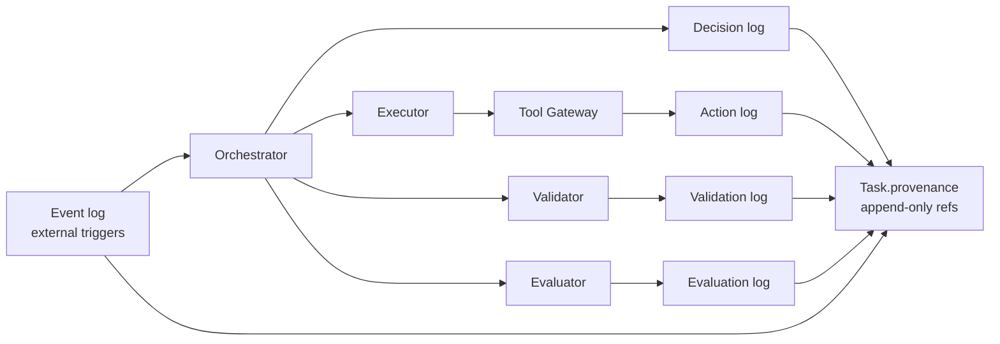

# Operations

This document covers what humans see, what gets logged, how the mesh is monitored without
a frontend in V1, and how cost/quality are managed via the model cascade.

---

## 1. The five log streams

| Log | What it captures | Mandatory fields |
|-----|------------------|------------------|
| **Event** | External or internal triggers entering the mesh | `tenant_id`, `task_id`, `actor`, `entrypoint`, `timestamp`, `payload_ref` |
| **Decision** | Choices made by orchestrator, planner, or agentic policy | `tenant_id`, `task_id`, `actor`, `decision_kind`, `reason`, `release_manifest_id`, `timestamp` |
| **Action** | Side-effecting tool calls through the Gateway | `tenant_id`, `task_id`, `tool_id`, `tier`, `credential_alias`, `result_ref`, `timestamp` |
| **Validation** | Contract Validator runs | `tenant_id`, `task_id`, `wave_index`, `verdict`, `failures[]`, `timestamp` |
| **Evaluation** | Evaluator outputs and criteria activity | `tenant_id`, `task_id`, `criteria_version`, `verdict`, `proposed_criteria[]`, `model_tier`, `timestamp` |

Common fields across all logs: `entry_id` (ULID), `prev_entry_id` (forms a per-Task chain), `recommended_action` where applicable.

One sample line from each stream is in [`examples/logs.example.json`](../examples/logs.example.json).

### 1.0 Log / provenance flow

Every log entry that needs to be re-surfaced to a human is referenced from `Task.provenance` by entry id.

### 1.1 Provenance fields surfaced for every human-facing notice

When a Task surfaces something to a human — an approval request, a duplicate confirmation,
an evaluator-proposed criterion — the message **must** include:

- **Actor** (who initiated the underlying work)
- **Entrypoint** (`slack`, `api`, `mcp`, `internal`)
- **Timestamp** (ISO-8601 UTC, plus a localized form)
- **Reason** (free text)
- **Recommended action**
- **Release manifest ID** and a one-line description of what changed since the last manifest, if relevant

This is the substrate that makes V1 monitorable without a UI.

---

## 2. Human monitoring without a frontend

In V1 there is no web UI. Humans interact with the mesh through three surfaces:

| Surface | What it's good for |
|---------|--------------------|
| **Slack** | Approvals, duplicate confirmations, evaluator proposals on the channel where the work originated. |
| **REST API** | Programmatic queries: `GET /tasks?state=AWAITING_HITL&tenant=T`, `GET /policies/proposed`, `GET /evaluations?verdict=fail`. |
| **MCP** | An external agent (including another mesh) can query the same surfaces using the same scope rules. |

### 2.1 Canonical queries

The implementing platform should expose at minimum:

- "What Tasks are paused waiting on me?" → API + Slack home tab listing.
- "What policies are proposed for this tenant?" → API + Slack DM digest.
- "What evaluator criteria are awaiting acceptance?" → API + Slack DM digest.
- "Show me the full audit trail of Task X" → API endpoint returning an interleaved view of events, decisions, actions, validations, evaluations.
- "What changed since release manifest R_n-1?" → API endpoint comparing two manifests.

---

## 3. Model cascade in practice

The cascade is an operational lever. Use the cheapest model that suffices and **record which tier was used and why** on every agent invocation.

| Tier | Default use |
|------|-------------|
| **S** | Intent classification, field extraction, simple lookup, duplicate-similarity scoring, status string normalization. |
| **M** | Most workflow steps, summarization, response formatting, routine planning from a recalled template. |
| **L** | Planning under ambiguity, governance edge cases (agentic enforcement), evaluation, policy compilation from natural language or document, version comparison, incident root-cause analysis. |

Operational rules:

1. Start every routine in **M**. Promote a step to **L** only when criteria show degradation.
2. **L** is mandatory for policy compilation and for agentic policy enforcement. Do not cascade these down silently.
3. The Evaluator runs at **L** by default. Cascading the Evaluator down requires a policy permitting it for the routine.
4. Per-Task cost and latency by tier are logged so cascading decisions are auditable.

---

## 4. Kill switch and DLQ operations

### 4.1 Kill switch
- Trippable from API or Slack (with appropriate role).
- Scopes: platform-wide, per-tenant, per-routine, per-policy.
- Every trip and untrip is a Decision log entry with actor, scope, reason.

### 4.2 DLQ
- DLQ entries are Tasks in `FAILED` state with `state_reason: poison_pill` and a reference to the offending payload.
- They are queryable via API (`GET /dlq?tenant=T`) and surfaceable in Slack.
- "Replay" creates a new child Task; the DLQ entry is itself never mutated.

---

## 5. Incident response

When something goes wrong, the canonical path is:

1. Find the affected Task(s) via API/MCP query.
2. Pull the full provenance chain.
3. Identify the responsible artifact (policy version, routine version, prompt version, tool plan version, platform release).
4. Trip the appropriate kill switch scope.
5. Open the postmortem; **L**-tier root-cause analysis is itself a Task that uses the same audit trail as its input.
6. Land the fix as a new version of the offending artifact (or a new platform release). Old Tasks stay pinned to the manifest under which they ran.

---

## 6. Cost and quality monitoring

The minimum operational telemetry to track:

- Tasks per state per tenant per day.
- Time-in-state distributions (especially `AWAITING_HITL` and `AWAITING_DUP_CONFIRM`).
- Evaluator verdict rates per routine.
- Proposed-vs-accepted criteria rate.
- Tool call counts per tier.
- Model tier distribution per routine.
- Duplicate-suppression rate.
- Kill switch trips and DLQ depth.

In V1 these are exposed as API endpoints returning JSON. Dashboards belong to a later milestone.
