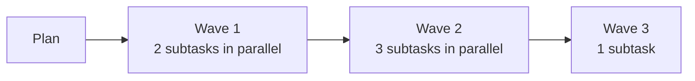
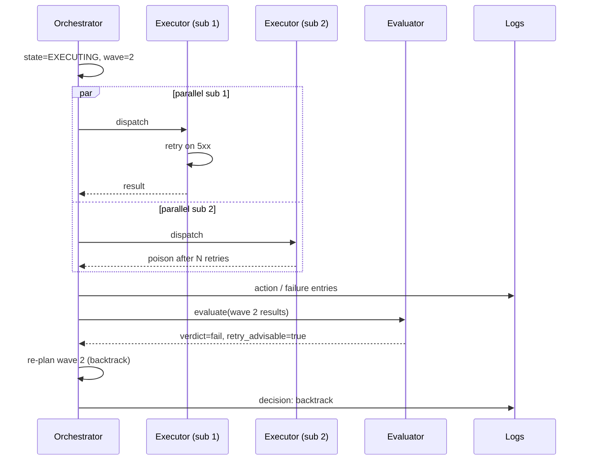

# Orchestration

The Orchestrator is the single owner of Task state. This document specifies its
responsibilities, the retry/idempotency split with executors, parallel execution,
duplicate detection, versioning under change, and the kill-switch / DLQ patterns.

---

## 1. Single-writer rule

The Orchestrator is the **only** component that may write a Task's `state`. Executors,
agents, the planner, governance, and the evaluator all *recommend* transitions; the
Orchestrator decides and writes.

This is the property that lets everything else be stateless and idempotent.

---

## 2. Retries and idempotency

Responsibility is split by **concern**:

| Concern | Who owns it | Mechanism |
|---------|-------------|-----------|
| End-to-end Task idempotency | Orchestrator | `idempotency_key` on the Task; duplicate requests with the same key return the existing Task. |
| Wave-level retry | Orchestrator | After a wave fails, decide retry (same wave, same plan), backtrack (re-plan), or fail. |
| Step-local retry | Executor | Transient errors from a tool call: HTTP 5xx, rate limit, transient network. Bounded retries with backoff. |
| Side-effect idempotency | Executor | If a step writes to an external system, the executor uses a deterministic external-side idempotency key (e.g. Monday.com mutation key derived from `task_id:wave_index:step_index`). |
| Agent re-invocation | Executor | Re-prompting an agent on schema-validation failure is local to the executor. |
| Replay safety | Orchestrator | Replaying a terminal Task is forbidden; a new child Task with `provenance.parent_task` is the replay. |

Rule of thumb: **if the retry could change Task state, it belongs to the Orchestrator. If it stays inside one step, it belongs to the Executor.**

---

## 3. Wave-based parallelism

A `plan` is an ordered list of **waves**. Each wave is a parallel batch of sibling subtasks.

Properties:

- Subtasks within a wave **must not depend on each other**. If they would, they belong in different waves.
- A wave completes when *all* its subtasks reach a terminal state.
- If any subtask fails irrecoverably, the Orchestrator decides between: cancel the rest, let the rest complete and report, or backtrack and re-plan.
- The Evaluator runs at wave boundaries.

---

## 4. Duplicate request detection

Goal: do not let users (or other agents) accidentally fire the same expensive workflow twice.

Algorithm:

1. On Task creation, compute a **similarity fingerprint** from `(actor, entrypoint, normalized_goal, salient_inputs)` using an **S** tier model for the natural-language portion and a deterministic hash for the structured portion.
2. Search active and recently-terminal Tasks within the last **15 minutes** for the same fingerprint within a similarity threshold.
3. If a candidate is found:
   - Transition to `AWAITING_DUP_CONFIRM`.
   - Ask the user on the originating surface: *"This looks like the request you made at HH:MM. Are these the same? [Yes, same] [No, different]"*.
4. On `Yes, same`: transition to `SUPPRESSED`. Record a suppression window of **24 hours** during which similar requests from the same actor are auto-suppressed without prompting (instead pointing at the original Task).
5. On `No, different`: continue to `PLANNING`. Also store a "false-match" hint so the same near-miss does not prompt again.
6. If no candidate: continue to `PLANNING`.

The 24h suppression is per `(actor, fingerprint)`. It expires automatically.

---

## 5. Versioning under change

### 5.1 Short-running Tasks: graceful drain
- If a policy, routine, or release changes while a short Task is running, the Task **continues against its pinned `release_manifest_id`**.
- New Tasks created after the change pick up the new manifest.
- No mid-flight migration.

### 5.2 Long-running Tasks: side-by-side versioning
- For Tasks whose expected lifetime exceeds the "short" threshold (e.g. multi-day campaigns, scheduled cohorts), the Orchestrator supports running the same logical Task under **two pinned versions simultaneously**.
- A reconciliation step compares the outputs and either auto-accepts when they agree or escalates to HITL when they diverge.
- This is the only mechanism by which a long-running Task picks up a mid-flight policy / routine update.

### 5.3 State compatibility
The Task contract version is part of the release manifest. The Orchestrator refuses to
process a Task whose contract version is unknown to its current release. This prevents
silent corruption when the platform itself is updated.

---

## 6. Kill switch and DLQ

### 6.1 Kill switch
A platform-wide and per-routine kill switch. When tripped:

- New Tasks targeting the scoped routine/policy/tenant are rejected at the entrypoint with a clear reason.
- In-flight Tasks transition to `CANCELLED` at the next wave boundary.
- The decision is logged with actor, timestamp, and reason; restoring service is also logged.

### 6.2 Poison-pill / DLQ
A message is a **poison pill** if it repeatedly causes the same executor to fail in a way step-local retries cannot recover.

- After N consecutive identical failures, the Executor reports `poison`.
- The Orchestrator moves the Task to `FAILED` with `state_reason: poison_pill` and writes the offending payload to the **DLQ**.
- A DLQ entry is itself reviewable via Slack/API/MCP and can be replayed (which creates a new child Task) after the cause is fixed.

---

## 7. Putting it together: a wave in motion

---

## 8. Non-goals for orchestration

- Cross-tenant scheduling (V1: per-tenant queues only).
- Hard real-time guarantees.
- Custom priority queues per user (priority is implicit from entrypoint and policy).
