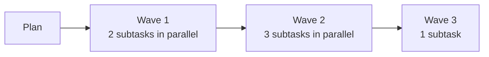
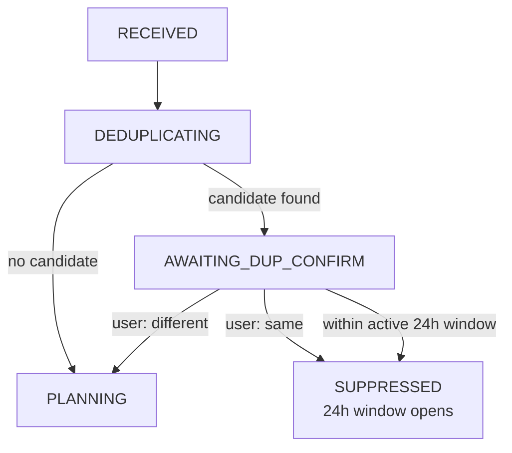
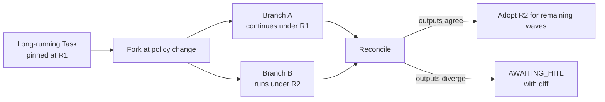
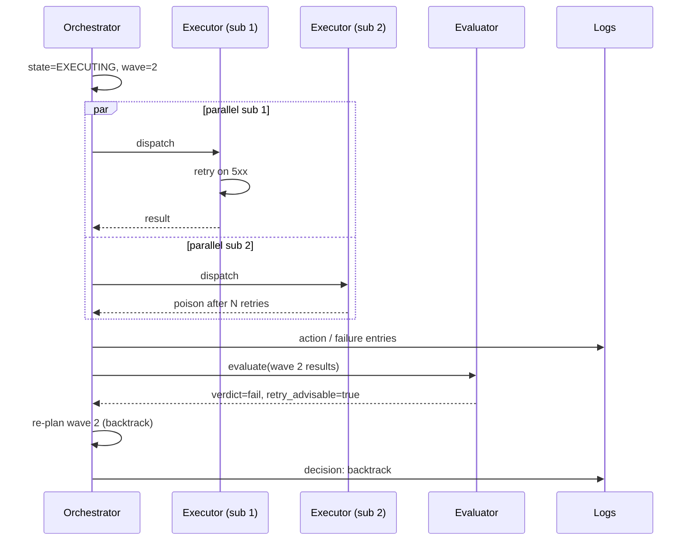

# Orchestration

The Orchestrator is the single owner of Task state. This document specifies its
responsibilities, the retry/idempotency split with executors, parallel execution,
duplicate detection, versioning under change, and the kill-switch / DLQ patterns.

---

## 1. Single-writer rule

The Orchestrator is the **only** component that may write a Task's `state`. Executors,
agents, the planner, governance, and the evaluator all *recommend* transitions; the
Orchestrator decides and writes.

This is the property that lets everything else be stateless and idempotent.

---

## 2. Retries and idempotency

Responsibility is split by **concern**:

| Concern | Who owns it | Mechanism |
|---------|-------------|-----------|
| End-to-end Task idempotency | Orchestrator | `idempotency_key` on the Task; duplicate requests with the same key return the existing Task. |
| Wave-level retry | Orchestrator | After a wave fails, decide retry (same wave, same plan), backtrack (re-plan), or fail. |
| Step-local retry | Executor | Transient errors from a tool call: HTTP 5xx, rate limit, transient network. Bounded retries with backoff. |
| Side-effect idempotency | Executor | If a step writes to an external system, the executor uses a deterministic external-side idempotency key (e.g. Monday.com mutation key derived from `task_id:wave_index:step_index`). |
| Agent re-invocation | Executor | Re-prompting an agent on schema-validation failure is local to the executor. |
| Replay safety | Orchestrator | Replaying a terminal Task is forbidden; a new child Task with `provenance.parent_task` is the replay. |

Rule of thumb: **if the retry could change Task state, it belongs to the Orchestrator. If it stays inside one step, it belongs to the Executor.**

---

## 3. Wave-based parallelism

A `plan` is an ordered list of **waves**. Each wave is a parallel batch of sibling subtasks.



Properties:

- Subtasks within a wave **must not depend on each other**. If they would, they belong in different waves.
- A wave completes when *all* its subtasks reach a terminal state.
- If any subtask fails irrecoverably, the Orchestrator decides between: cancel the rest, let the rest complete and report, or backtrack and re-plan.
- The Evaluator runs at wave boundaries.

### 3.1 Dynamic spawning and recursion

A wave is **static** when its subtasks are declared up front by a recalled routine or
the Planner. A wave is **dynamic** when the Swarm Supervisor decides at runtime to
expand the plan (add a new wave, or have a child agent recurse and spawn its own
children). Both cases use the same wave machinery; the difference is *who* declared
the contents.

Semantics:

- **Wave-based dynamic spawning** is the V1 default. After each wave completes, the
  supervisor may propose a next wave or a recursive expansion. The Orchestrator
  schedules it only if the supervisor's gate (policy / budget / risk / provenance /
  marginal utility — see [swarm-supervisor.md §3](swarm-supervisor.md)) passes.
- **Recursion is enabled by default**, but only inside the autonomy policy in scope.
  A spawn whose `depth + 1` exceeds `policy.max_recursion_depth` is rejected.
- Recursion can **only** occur inside policy, budget, and risk boundaries. Any one of
  them denies; all of them must permit. This rules out the case where a generous
  recursion limit is silently combined with an exhausted token budget.
- A child Task inherits the parent's `release_manifest_id`, `tool_plan_id`, and
  `tenant_id`, and consumes a *fraction* of the parent's remaining budget — never the
  full budget.

### 3.2 Default conservative autonomy budget

The defaults below are deliberately small. Policy at any of the scopes in
[governance.md §9](governance.md) can raise or lower them.

```yaml
autonomy_budget:
  max_waves: 3
  max_child_agents_per_wave: 5
  recursion_enabled: true
  max_recursion_depth: 1            # rationale: V1 prefers shallow expansion; deeper
                                    # recursion is opt-in per tenant/routine because
                                    # blast radius grows multiplicatively with depth.
  max_wall_clock_minutes: null      # user/policy configurable
  max_tool_calls: null              # user/policy configurable
  max_model_calls: null             # user/policy configurable
  max_token_budget: null            # user/policy configurable
  max_total_spawns: 50              # runaway-swarm cutoff (see kill switch §6)
```

A populated, illustrative budget is in
[`examples/autonomy-policy.example.yaml`](../examples/autonomy-policy.example.yaml).

**All thresholds are user/policy configurable.** The Orchestrator enforces whatever
the resolved autonomy policy says; the defaults above only apply when no policy at any
scope sets a value.

---

## 4. Duplicate request detection

Goal: do not let users (or other agents) accidentally fire the same expensive workflow twice.

### 4.1 Fingerprint

The **similarity fingerprint** is computed at Task creation from these fields, in this order:

| Field | Source | Treatment |
|-------|--------|-----------|
| `tenant_id` | Task | Exact match required. Fingerprints are **always scoped to one tenant**; cross-tenant deduplication is forbidden by construction. |
| `actor.id` | Task | Exact match required. |
| `entrypoint` | Task | Exact match required. (A Slack-originated request never collides with an API-originated one.) |
| `normalized_goal` | Task.goal | Lowercased, whitespace-collapsed, stop-word-trimmed, then embedded by an **S**-tier model. |
| `salient_inputs` | Task.inputs (subset) | Routine-declared "salient" fields (e.g. for Workflow A: `tldv_recording_url`, `monday_board_name`). Hashed deterministically (SHA-256 over a canonical JSON form). |

The result is a record `{tenant_id, actor_id, entrypoint, salient_hash, goal_embedding}` plus a derived `fingerprint` id (SHA-256 over the canonical form, with the embedding rounded to a quantized vector for hashability).

A concrete shape is in [`examples/dedup-fingerprint.example.json`](../examples/dedup-fingerprint.example.json).

### 4.2 Storage and retention

- Fingerprints are stored in the `dedup_index` table for **24 hours** after Task creation, regardless of the Task's terminal outcome.
- Storage is **per-tenant** with row-level scope; no cross-tenant join is possible.
- A background sweep drops fingerprints older than 24h. There is no longer-term retention.

### 4.3 Algorithm

1. On Task creation, compute the fingerprint as above.
2. Search the `dedup_index` for the same `(tenant_id, actor_id, entrypoint, salient_hash)` plus embedding cosine similarity ≥ **0.92** (the V1 default; configurable per tenant) within the last **15 minutes**.
3. **Terminal-state eligibility.** A candidate is eligible if it is either still active *or* in a terminal state of `SUCCEEDED`, `SUPPRESSED`, or `AWAITING_DUP_CONFIRM`. Tasks that ended in `FAILED`, `DENIED`, or `CANCELLED` are **not** eligible candidates — those represent intentional re-tries, not duplicates.
4. If an eligible candidate is found:
   - Transition the new Task to `AWAITING_DUP_CONFIRM`.
   - Ask the user on the originating surface: *"This looks like the request you made at HH:MM. Are these the same? [Yes, same] [No, different]"*.
5. On `Yes, same`: transition to `SUPPRESSED`. Open a **24-hour suppression window** keyed by `(tenant_id, actor_id, fingerprint)` during which matching requests are auto-suppressed without prompting (the user is instead pointed at the original Task).
6. On `No, different`: continue to `PLANNING`. Also store a "false-match" hint so the same near-miss does not prompt again.
7. If no candidate: continue to `PLANNING`.

### 4.4 Suppression-window behavior

- The window is **per `(tenant_id, actor_id, fingerprint)`** and expires automatically after 24 hours.
- A new request inside the window is **not** prompted; the Task transitions directly to `SUPPRESSED` and the response surfaces a link to the original Task.
- After 24 hours, the suppression expires and a similar request will once again pass through the `AWAITING_DUP_CONFIRM` flow.

### 4.5 Dedup branch in the orchestration flow



---

## 5. Versioning under change

### 5.1 Short-running Tasks: graceful drain
- If a policy, routine, or release changes while a short Task is running, the Task **continues against its pinned `release_manifest_id`**.
- New Tasks created after the change pick up the new manifest.
- No mid-flight migration.

### 5.2 Long-running Tasks: side-by-side versioning
- For Tasks whose expected lifetime exceeds the "short" threshold (e.g. multi-day campaigns, scheduled cohorts), the Orchestrator supports running the same logical Task under **two pinned versions simultaneously**.
- A reconciliation step compares the outputs and either auto-accepts when they agree or escalates to HITL when they diverge.
- This is the only mechanism by which a long-running Task picks up a mid-flight policy / routine update.



### 5.3 State compatibility
The Task contract version is part of the release manifest. The Orchestrator refuses to
process a Task whose contract version is unknown to its current release. This prevents
silent corruption when the platform itself is updated.

---

## 6. Kill switch and DLQ

### 6.1 Kill switch
A platform-wide, per-routine, per-tenant, per-entrypoint, or **per-swarm-depth** kill
switch. When tripped:

- New Tasks targeting the scoped routine/policy/tenant are rejected at the entrypoint with a clear reason.
- In-flight Tasks transition to `CANCELLED` at the next wave boundary.
- The decision is logged with actor, timestamp, and reason; restoring service is also logged.
- A **runaway swarm** — a Task whose spawn-ledger row count exceeds `max_total_spawns` —
  is cancelled via the same machinery, with `state_reason: runaway_swarm`. See
  [swarm-supervisor.md §7](swarm-supervisor.md).

### 6.2 Poison-pill / DLQ
A message is a **poison pill** if it repeatedly causes the same executor to fail in a way step-local retries cannot recover.

- After N consecutive identical failures, the Executor reports `poison`.
- The Orchestrator moves the Task to `FAILED` with `state_reason: poison_pill` and writes the offending payload to the **DLQ**.
- A DLQ entry is itself reviewable via Slack/API/MCP and can be replayed (which creates a new child Task) after the cause is fixed.

---

## 7. Putting it together: a wave in motion



---

## 8. Non-goals for orchestration

- Cross-tenant scheduling (V1: per-tenant queues only).
- Hard real-time guarantees.
- Custom priority queues per user (priority is implicit from entrypoint and policy).
