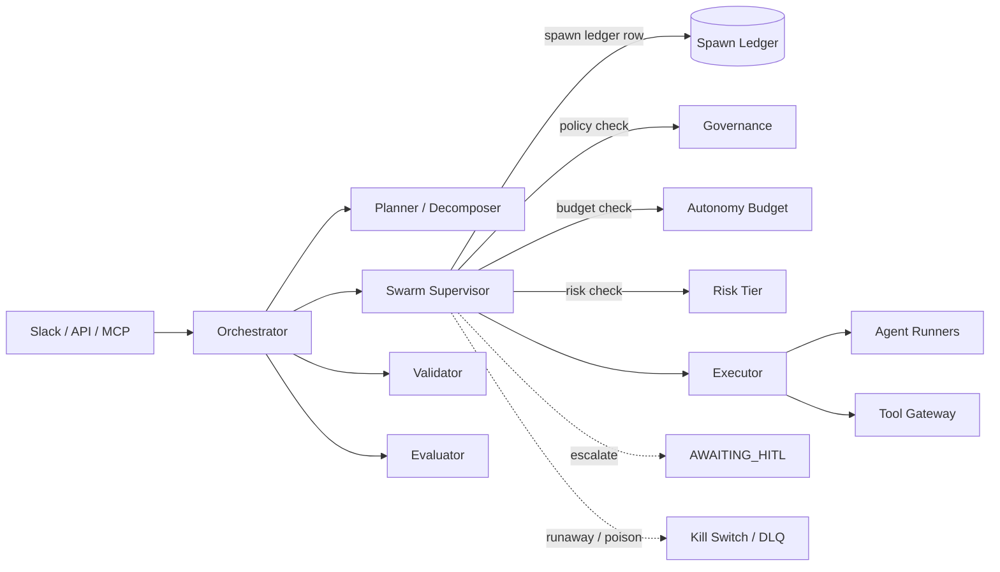

# Swarm Supervisor

The **Swarm Supervisor** is the contractual control component that governs **dynamic
spawning** of child agents and child Tasks inside the mesh. It is the difference between
"the mesh runs a predeclared plan" and "the mesh expands its own plan under bounded
autonomy".

The Orchestrator owns Task `state`. The Swarm Supervisor owns the *decision to spawn
more work* and the ledger that records every expansion. Neither component substitutes
for the other.

---

## 1. Why a contractual supervisor

A monolithic agent that recursively spawns sub-agents has no audit chain, no budget,
and no stop condition. A purely static workflow engine cannot adapt when a wave's
output reveals work that was not knowable at planning time.

The Swarm Supervisor is the middle path:

- Spawning is **bounded** by policy, budget, and risk tier.
- Every spawn is **logged** in the spawn ledger before the child runs.
- Recursion is **allowed**, but only inside the depth/budget/policy envelope the user or
  tenant has declared.
- The mesh can refuse, escalate, or kill a runaway expansion at any wave boundary.

The supervisor sits between the Planner/Decomposer (which produces the initial plan)
and the Executor (which runs steps). It does not produce plans by itself; it decides
**whether** to expand a plan and **what** to spawn when expansion is justified.

---

## 2. V1 behavior

| Property | V1 default |
|----------|------------|
| Spawning model | **Wave-based dynamic spawning.** Each wave is a parallel batch of sibling subtasks. The supervisor evaluates after each wave whether to spawn another wave or recurse. |
| Recursion | **Enabled by default**, constrained by a conservative `max_recursion_depth` and the autonomy policy in scope. A child Task may spawn its own children only while inside the parent's depth, budget, and risk envelope. |
| Default `max_recursion_depth` | **1** (one level of children below the root). See [orchestration.md §3.1](orchestration.md) for the rationale and how to raise it. |
| Default `max_waves` | **3** per Task. |
| Default `max_child_agents_per_wave` | **5**. |
| Wall-clock, tool, model, token budgets | User/policy configurable — see the autonomy-policy example in [`examples/autonomy-policy.example.yaml`](../examples/autonomy-policy.example.yaml). |
| Implementation candidate | A durable workflow engine (e.g. Temporal) is a reasonable **implementation candidate** for the swarm control loop. The Swarm Supervisor is **not** the agent SDK — it is the contract a durable loop must enforce. |

The defaults are deliberately conservative. Policy raises or lowers them per task type,
tenant, actor, risk tier, entrypoint, routine, or tool plan (see
[governance.md §9](governance.md)).

---

## 3. Spawn expansion gate

Before the supervisor spawns a wave or a recursive child, **all five checks must
pass**, in order:

| # | Check | Source of truth | Failure handling |
|---|-------|-----------------|------------------|
| 1 | **Policy check** | Governance / Policy Engine — autonomy policy fields in scope (see [governance.md §9](governance.md)). | Block; emit HITL request if `on_violation: require_hitl`. |
| 2 | **Budget check** | Live counters for waves, child agents, wall-clock, tool calls, model calls, tokens. | Block; emit Decision log entry `spawn_denied: budget_exhausted`; escalate via §6 if `escalate_on_exhaustion`. |
| 3 | **Risk check** | Risk tier of the proposed child (derived from its `tool_intents`, `external_egress`, and target system). | Block; require HITL if risk exceeds `external_write_tier_limit`. |
| 4 | **Provenance log** | Spawn ledger row written before the child is dispatched. | If the ledger write fails, the spawn is aborted — no child runs without a ledger entry. |
| 5 | **Marginal-utility reason** | A short justification of why this expansion is expected to improve the outcome relative to terminating the current wave. | Block; emit Decision log `spawn_denied: no_marginal_utility`. |

The order matters. Policy and budget are deterministic and cheap; they run first to
avoid wasting **L**-tier model calls justifying a spawn that policy already forbids.

---

## 4. Spawn ledger

Every spawn the supervisor approves writes one row to the **spawn ledger** before the
child Task or child agent is dispatched. The ledger is append-only and tenant-scoped.

| Field | Description |
|-------|-------------|
| `spawn_id` | ULID. |
| `tenant_id` | Tenant scope. |
| `parent_task_id` | The Task that requested the expansion. |
| `parent_agent_id` | The agent that proposed the spawn, if any. |
| `child_task_id` | The Task being spawned (filled in after the ledger row is written; the supervisor reserves the ID). |
| `child_agent_role` | Role label: `extractor`, `summarizer`, `judge`, `planner`, etc. |
| `reason` | Free-text marginal-utility justification (from §3 check 5). |
| `model_tier` | `S`, `M`, or `L`. |
| `tools[]` | Declared tool intents and trust tiers. |
| `budgets` | The portion of the parent's autonomy budget allocated to this child (waves, agents, tokens, wall-clock). |
| `risk_tier` | `low`, `medium`, `high`. |
| `wave_index` | The wave this spawn belongs to (parent's wave). |
| `depth` | Recursion depth from the root Task. Root = 0. |
| `output_contract` | The `output_schema` reference the child must satisfy. |
| `disposition` | One of `pending`, `running`, `succeeded`, `failed`, `denied`, `cancelled`, `superseded`. |
| `release_manifest_id` | The pinned manifest the child runs against (inherited from the parent). |
| `provenance` | Pointers to the parent Decision log entry, the spawning agent's prompt/version, and the policy IDs evaluated. |
| `created_at`, `updated_at`, `closed_at` | ISO-8601 UTC. |

A populated row is in [`examples/spawn-ledger.example.json`](../examples/spawn-ledger.example.json).

The ledger is the substrate that lets the monitoring queries in
[operations.md §6](operations.md) answer "how many agents did this Task spawn, how
deep did it recurse, and where did the budget go?"

---

## 5. Recursion semantics

Recursion is **allowed by default** but is treated as a special case of dynamic
spawning, not a separate mechanism.

- A child Task created by the supervisor inherits the parent's `release_manifest_id`,
  `tool_plan_id`, and `tenant_id`. It receives a *fraction* of the parent's remaining
  budget — never the full budget.
- `depth` is monotonically increasing from root (`0`). Each spawn increments depth on the
  child relative to its parent's depth.
- A spawn is rejected if `depth + 1 > policy.max_recursion_depth` for the scope in
  effect. Rejection emits a Decision log `spawn_denied: max_recursion_depth` and may
  escalate to HITL if the policy says so.
- Recursion is **only legal inside policy/budget/risk boundaries**. A recursive spawn
  that would breach any one of them is rejected even if the others permit it.
- Loopback through the MCP entrypoint (the mesh invoking itself — see
  [architecture.md §2.1](architecture.md)) is treated as a spawn: it requires a ledger
  entry and counts against the autonomy budget.

---

## 6. HITL escalation triggers

The supervisor escalates a spawn decision (or an in-flight expansion) to HITL when any
of the following fires. Escalation transitions the parent Task to `AWAITING_HITL`
exactly as in [governance.md §6](governance.md); the spawn is blocked until a human
approves or denies.

| Trigger | Condition |
|---------|-----------|
| **Policy boundary** | A policy with `on_violation: require_hitl` is matched by the proposed spawn. |
| **High risk** | Proposed child's `risk_tier` exceeds the policy's `external_write_tier_limit` (or other risk-tier ceiling). |
| **Budget exhaustion** | Any one of `max_waves`, `max_child_agents_per_wave`, `max_wall_clock_minutes`, `max_tool_calls`, `max_model_calls`, `max_token_budget` is at or past its limit. |
| **Low confidence** | The spawning agent's self-reported confidence on the marginal-utility justification is below the policy's `min_confidence_to_spawn`. |
| **Disagreement** | Two or more spawning agents produce contradictory recommendations on the same parent step (e.g. one says "spawn judge", another says "terminate wave"). |
| **External high-impact write** | Proposed child intends a tool call in `{write_destructive, external_egress}` against a tier-flagged target. |
| **Recursion threshold** | `depth + 1` is at the warning threshold (typically `max_recursion_depth - 0` for the strict default; policies may set a soft warning at `depth == max_recursion_depth - 1`). |
| **Kill-switch condition** | The platform-wide or per-routine kill switch is tripped for the scope of the spawn (see [operations.md §4](operations.md)). |

Escalations are themselves Decision-log entries, and they always carry a
`recommended_action` so the human can approve, deny, or approve-with-edits without
re-deriving context.

---

## 7. Kill switch and DLQ for runaway swarms

The Swarm Supervisor honors the kill-switch and DLQ machinery already defined in
[orchestration.md §6](orchestration.md), with two additions specific to swarms:

### 7.1 Runaway swarm

If a Task's spawn ledger crosses a configured `max_total_spawns` (e.g. 50 children at
any depth), the supervisor:

1. Refuses further spawns.
2. Transitions the parent Task to `CANCELLED` at the next wave boundary, with
   `state_reason: runaway_swarm`.
3. Marks all in-flight children `disposition: cancelled` and lets their executors
   clean up.
4. Emits a Decision log entry visible through the canonical operator queries.

### 7.2 Poison-pill child

A child Task that repeatedly fails identical retries inside the executor is treated as
a poison pill — the existing DLQ flow applies, with one extension: the supervisor
*also* records the poison-pill disposition on the spawn-ledger row so the parent's
audit trail is complete.

### 7.3 Per-scope kill switches

The kill switch can be scoped to:

- The platform (everything halts).
- A tenant.
- A routine.
- An entrypoint.
- A **swarm depth ceiling** — e.g. "no more spawns at depth ≥ 2 in tenant T for the
  next hour".

The last scope is unique to the supervisor; it lets an operator stop a recursion storm
without halting the rest of the tenant's work.

---

## 8. Where the supervisor sits in the control plane

The supervisor never writes Task `state` — it asks the Orchestrator to. It never
invokes tools directly — it asks the Executor to. Its single output is *the decision
to spawn (or not)* plus a ledger row.

---

## 9. What the supervisor is **not**

- Not an agent SDK. Temporal (or any other durable-workflow engine) is an
  implementation candidate for the underlying control loop; the supervisor is a
  contract.
- Not a planner. It receives or accepts plans; it does not generate them de novo.
- Not a governance layer. It *consults* governance for every spawn; it does not author
  policy.
- Not an evaluator. It does not score child output; it observes the disposition the
  Evaluator and Validator report and updates the ledger.
- Not optional in V1 for any flow that uses dynamic spawning. Static, predeclared
  routines may run without ever invoking the supervisor; any expansion beyond the
  declared plan goes through it.
