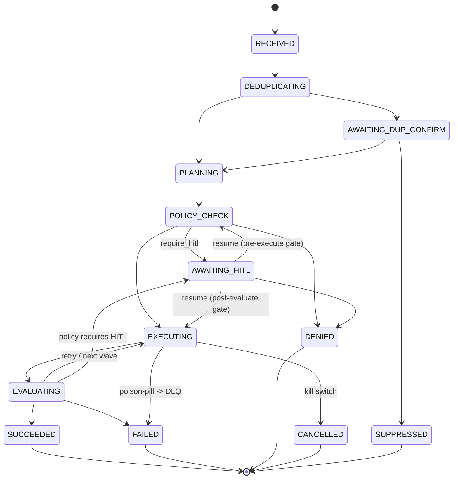

# Task Contract

The **Task** is the single object that crosses every plane of the mesh. Everything else
(plans, waves, tool calls, evaluations) attaches to a Task. If you understand this object,
you can read every other doc in the repo.

---

## 1. Shape

A Task is a record with the following fields. Field names are normative; types are described in plain language.

| Field | Required | Description |
|-------|----------|-------------|
| `task_id` | yes | Globally unique ID. Format: `task_` + ULID. |
| `parent_task_id` | no | If this is a subtask, the parent. Root tasks omit this. |
| `root_task_id` | yes | The top-level ancestor. For roots, equals `task_id`. |
| `tenant_id` | yes | Tenant scope. Every Task belongs to exactly one tenant. |
| `intake_id` | no | Optional reference to the intake artifact this Task was created from. See [intake.md](intake.md). |
| `correlation_id` | no | Optional. Propagated across child Tasks, log entries, spawn-ledger rows, Knowledge Layer reads, and egress checks. See [knowledge-layer.md §8](knowledge-layer.md). |
| `claim_evidence_map_ref` | no | Optional reference to a claim-evidence sidecar. Required at egress for any output that asserts facts about external entities. See [knowledge-layer.md §3](knowledge-layer.md). |
| `entrypoint` | yes | One of `slack`, `api`, `mcp`, `internal` (loopback, scheduled, child task). `graphql` is reserved for a future entrypoint and **not** valid in V1. See [architecture.md §2](architecture.md). |
| `actor` | yes | Who initiated: human user ID, agent ID, or service ID. Includes display name and source-system identifier. |
| `goal` | yes | Natural-language intent. Preserved verbatim. |
| `inputs` | yes | Structured inputs (Slack message refs, URLs, file IDs, query params). |
| `idempotency_key` | yes | Client-provided or Orchestrator-assigned. Used for duplicate detection. |
| `state` | yes | See §2. |
| `state_reason` | no | Free-text explanation for the current state. Always present on terminal states. |
| `governance_scope` | yes | Policy IDs evaluated for this Task (resolved at creation). |
| `release_manifest_id` | yes | The exact pinned bundle this Task runs against. See [versioning.md](versioning.md). |
| `plan` | no | Present once Planner has run: ordered waves of subtask intents. |
| `wave_index` | no | Current wave being executed, if any. |
| `routine_id` | no | If this Task is executing a known routine. |
| `routine_version` | no | Pinned version of that routine. |
| `tool_plan_id` | yes | Active tool plan for this tenant + Task. |
| `result` | no | Final output of the Task, validated against `output_schema`. |
| `output_schema` | yes | Shape contract for `result`. |
| `evaluations` | no | List of evaluator results, including proposed criteria. |
| `hitl` | no | If paused for human review: `requested_at`, `reason`, `approver`, `decision`, `decided_at`. |
| `provenance` | yes | Chain of references to logs, parents, source artifacts, prior Tasks if recalled. |
| `created_at`, `updated_at`, `closed_at` | yes / yes / no | ISO-8601 UTC. |

A concrete instance is in [`examples/task.example.json`](../examples/task.example.json).

---

## 2. State machine

The Orchestrator is the **only** writer of `state`.



State definitions:

| State | Meaning | Terminal? |
|-------|---------|-----------|
| `RECEIVED` | The Orchestrator has accepted and persisted the Task from an entrypoint but has not yet begun any control-plane processing. This is the first state every Task occupies; it exists so the audit chain has a definite "task was created" anchor distinct from "deduplicating began". | no |
| `DEDUPLICATING` | Checking for duplicates in the 15-minute window. See [orchestration.md §4](orchestration.md). | no |
| `AWAITING_DUP_CONFIRM` | Probable duplicate; awaiting user confirmation. | no |
| `PLANNING` | Planner/Decomposer is producing a plan. | no |
| `POLICY_CHECK` | Governance evaluating; may transition to `AWAITING_HITL` or `DENIED`. | no |
| `AWAITING_HITL` | Paused for human approval. Resumes to the state the gate fired from (`POLICY_CHECK` or `EVALUATING`), or transitions to `DENIED`. See §3. | no |
| `EXECUTING` | A wave is running. | no |
| `EVALUATING` | Evaluator scoring wave output. | no |
| `SUCCEEDED` | Result available, validated, evaluated. | yes |
| `FAILED` | Unrecoverable error. `state_reason` mandatory. | yes |
| `DENIED` | Policy denied or HITL rejected. | yes |
| `CANCELLED` | Kill switch invoked or user cancellation. | yes |
| `SUPPRESSED` | Duplicate detected and confirmed; suppressed for 24h. | yes |

### 2.1 Evaluator-proposed criteria do not pause Tasks

The `EVALUATING -> AWAITING_HITL` edge fires **only** when a governance policy attached
to evaluation outcomes requires HITL (for example a `post_evaluation` trigger with
`on_violation: require_hitl`, or a low-quality verdict policy).

When an Evaluator merely **proposes a new criterion**, the criterion is written to the
criteria store as a `proposed` review record **asynchronously**. The Task does not pause
and does not transition. Proposed criteria are surfaced through the review channels
described in [operations.md §2](operations.md) and accepted by a human or by a policy
that authorizes auto-acceptance — see [evaluator.md §4](evaluator.md) and
[governance.md §7](governance.md).

---

## 3. Transition rules

1. **Single writer.** Only the Orchestrator transitions `state`. Any other writer is a bug.
2. **Validator gate.** Before *and* after a transition, the Contract Validator checks the relevant subset of fields. Failures revert to the previous state with a Validation log entry.
3. **Forward-only by default.** Re-entry into `EXECUTING` is allowed for retries and for the next wave; otherwise transitions are forward-only.
4. **HITL is a pause, not a branch.** `AWAITING_HITL` can be reached from `POLICY_CHECK` (pre-execute gate), `EVALUATING` (post-execute gate), or **`EGRESS_CHECK`** (pre-egress gate — when an egress guard fails with `require_hitl`; see [knowledge-layer.md §5](knowledge-layer.md) and [governance.md §6](governance.md)). On approve, the Task resumes to the state the gate fired from. On deny, the Task transitions to `DENIED`. The `hitl` block records `from_state` so the resume target is unambiguous.
5. **Terminal states are immutable.** Once `SUCCEEDED`, `FAILED`, `DENIED`, `CANCELLED`, or `SUPPRESSED`, the Task is read-only. To "retry", create a child Task with provenance referencing the original.
6. **Deterministic egress check is non-state-changing.** The eight deterministic egress guards (see [knowledge-layer.md §5](knowledge-layer.md)) run inside an `EXECUTING` wave and **do not** introduce a new Task lifecycle state. A guard failure either (a) reverts the wave with an `egress_blocked` Decision log entry, or (b) escalates to `AWAITING_HITL` with `hitl.from_state = EGRESS_CHECK` recorded as a sub-phase of `EXECUTING`. The set of Task `state` values is unchanged from v0.1.2.

---

## 4. Subtasks and waves

- A Task may declare `plan.waves[]`. Each wave is a parallel batch of sibling subtasks.
- Subtasks share `root_task_id` and inherit `tenant_id`, `tool_plan_id`, and `release_manifest_id`.
- Subtasks may have their own `governance_scope` (a child step may require a stricter policy than its parent).
- A wave is complete when every subtask is in a terminal state. The Orchestrator then evaluates the wave and proceeds to the next or to `EVALUATING` of the parent.

---

## 5. Provenance

`provenance` is an append-only list of references. Each entry is one of:

| Kind | Points at |
|------|-----------|
| `event` | An Event log entry (Slack message, API call, etc.) |
| `parent_task` | A parent Task |
| `recalled_routine` | A routine version |
| `source_artifact` | An external resource (tl;dv recording, Google Doc, Monday item) |
| `policy_decision` | A specific policy enforcement |
| `evaluation` | An evaluation log entry |
| `hitl_decision` | A human decision with actor, timestamp, reason |
| `intake` | The intake artifact this Task was created from. See [intake.md](intake.md). |
| `evidence` | A Knowledge Layer entry or claim-evidence sidecar referenced by this Task. See [knowledge-layer.md](knowledge-layer.md). |
| `egress_check` | A deterministic egress-check record (the eight-guard run). See [knowledge-layer.md §5](knowledge-layer.md). |

This is what gives the no-frontend monitoring story (Slack/API/MCP) enough context to surface a clean "why did this happen" answer.

---

## 6. Dedup fingerprint

If the Orchestrator detected a candidate duplicate, the Task carries a `dedup` block:

```json
"dedup": {
  "fingerprint": "sha256:...",
  "fingerprint_fields": ["actor.id", "entrypoint", "normalized_goal", "salient_inputs"],
  "candidate_task_ids": ["task_01HX..."],
  "confirmed_duplicate_of": null,
  "suppression_expires_at": null
}
```

See [orchestration.md §4](orchestration.md) for the full algorithm and retention rules.

---

## 7. Versioning of the contract itself

The Task contract has its own version, stored on the `release_manifest_id`. Backward-compatible changes (added optional fields) do not require a major bump. Renames or removed fields do. The Orchestrator refuses to process a Task whose contract version is unknown to its current release.
