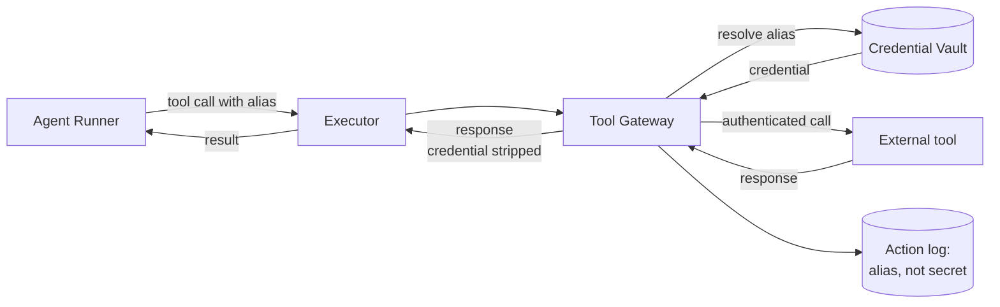

# Tool Plans, Trust Tiers, and Credentials

The Tool Gateway is the boundary where the mesh meets the outside world. This document
specifies trust tiers, per-tenant tool plans, credential isolation, and tenant separation.

---

## 1. Trust tiers

Every tool a Task can call is classified into one of five tiers. The classification
is a property of the tool *in a given tenant's tool plan*, not a universal label —
the same underlying API can be `read_safe` in one tenant and `read_sensitive` in
another depending on what data lives behind it.

| Tier | Examples | Allowed by default? | Notes |
|------|----------|--------------------|-------|
| `read_safe` | Public web fetch, internal docs index, lookups on non-sensitive tables | yes (subject to tenant policy) | No PII, no money, no destructive intent. |
| `read_sensitive` | Read access to customer records, billing data, PII fields | requires policy permit | Always logged with the specific record class read. |
| `write_revocable` | Create a Monday.com task, append a row to a Google Sheet, post a Slack message in an internal channel | requires policy permit | Mistakes are recoverable by humans. |
| `write_destructive` | Delete records, modify financial state, send external customer-facing email, push to production | always requires HITL by default | Default policy gates this tier behind `require_hitl`. |
| `external_egress` | Send data to third parties not previously bound by data-processing agreements | per-policy explicit allow | Audited at the network level. |

Tier escalation is one-way per Task: a Task that begins as `read_safe` cannot silently elevate to `write_destructive` mid-execution. Elevation must be a planned step gated by policy.

---

## 2. Tool plan

A **tool plan** is a per-tenant document declaring which tools the mesh may use,
at which tier, with which credential alias. An example is in
[`examples/tool-plan.example.yaml`](../examples/tool-plan.example.yaml).

Fields per entry:

| Field | Description |
|-------|-------------|
| `tool_id` | Stable identifier for the tool (e.g. `monday.items.create`). |
| `tier` | One of the five tiers above. |
| `credential_alias` | An alias the Gateway resolves at call time. Never the secret itself. |
| `quota` | Optional per-window call quota. |
| `policy_refs` | Policies that gate this tool. |
| `enabled` | Boolean. Disabling here is the cheapest kill switch. |

---

## 3. Defaults and client-specific packs

The mesh is a generic core. Per-client behavior is delivered as **tool plan packs**.

### 3.1 Default pack (every tenant)
- **MCP Gateway** — for tool-shaped access to other mesh services and MCP-exposed integrations.
- **Google Workspace** — Drive, Docs, Sheets, Gmail (typically `read_safe` + `read_sensitive`; `write_revocable` for Sheets/Docs creation).
- **Slack** — read of designated channels, write to designated channels (`write_revocable`).

### 3.2 Common client-specific packs
- **Monday.com** — project/CRM ops.
- **tl;dv** — meeting recordings and transcripts.
- **HubSpot** — CRM operations.
- **Stripe** — billing reads typically; writes are `write_destructive`.
- **BigQuery / Snowflake** — analytics reads typically `read_sensitive`.
- **Segment** — event reads/writes.
- **Twilio** — SMS/voice; outbound is `write_destructive` by default.
- **GitHub** — code reads `read_safe`, PR comments `write_revocable`, force-push `write_destructive`.
- **Jira / Notion** — issue and doc ops.

Each pack ships its own default policy proposals that the tenant accepts as part of onboarding.

---

## 4. Credentials: the Tool Gateway invariant

**Credentials never enter agent context.**

- Credentials are stored encrypted, indexed by `(tenant_id, credential_alias)`.
- The Tool Gateway resolves credentials *at call time* and forwards the call.
- Agents receive only the credential **alias** in their tool definition, never the value.
- Logs record the alias used; the secret is never serialized to any log stream.

If an agent attempts to access the credential value directly, the request is refused at the Gateway and an Action log entry of type `credential_leak_attempt` is written.

---

## 5. Tenant / client isolation

Tenant isolation is a property of every component:

| Component | Isolation mechanism |
|-----------|---------------------|
| Task store | Row-level by `tenant_id`; queries always filter on it. |
| Policy store | Policies are tenant-scoped or `global`; resolution always intersects with tenant. |
| Routine store | Routines are tenant-scoped unless explicitly `global`. |
| Tool plan | One active tool plan per tenant. |
| Credentials | Vault entries keyed by `(tenant_id, credential_alias)`; no cross-tenant lookup is possible by construction. |
| Logs | Tenant-tagged; cross-tenant query requires platform-admin role and is itself logged. |
| Agent runners | Stateless; tenant context is supplied per invocation and never cached across tenants. |
| MCP server | Per-tenant subdomain or scoped token; loopback honors the same tenant. |

Cross-tenant data flow is forbidden by default. A policy can permit a specific, audited
cross-tenant operation (e.g. a platform-admin migration), but the Gateway will refuse
otherwise.

---

## 6. Adding a new tool

The procedure (documented for the implementing repo):

1. Add the tool definition (id, tier proposal, declared side-effect class, schema).
2. Add a default policy proposal that gates the tool appropriately for its tier.
3. Add it to the tool plan packs that should expose it.
4. Add at least one routine (or routine update) that exercises it, with declared `tool_intents`.
5. Add criteria for evaluating tool outputs.
6. Cut a new platform release manifest pinning the additions.

No tool reaches a Task without all six steps.
