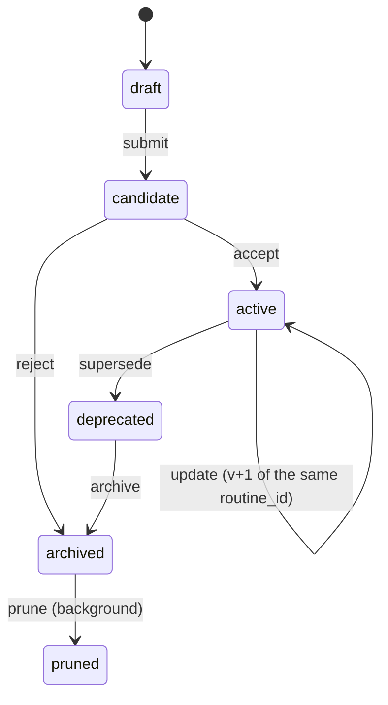
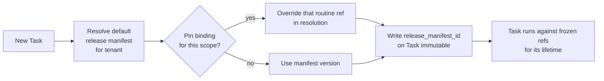

# Versioning

The mesh has **two distinct kinds of versioned artifacts**, and they are versioned very differently.

| Kind | Lives in | Versioned by |
|------|----------|--------------|
| **Platform code** | A git repository (separate from this docs repo) | Git tags, human-managed semver |
| **Dynamic artifacts** | The application database | DB rows with embedded manifests |

This split is deliberate. Platform code changes via PRs and tags. Routines, policies,
and criteria change at runtime — sometimes proposed by the system itself — and need
versioning that is not gated on a deploy.

---

## 1. Version reference syntax

Every reference to a versioned artifact in this repository uses the form:

```
<artifact_id>@<version>
```

| Example | Meaning |
|---------|---------|
| `rt_tldv_to_monday@2` | Version 2 of a routine. Routine versions are monotonic integers. |
| `pol_external_customer_writes@3` | Version 3 of a policy. Policy versions are monotonic integers. |
| `cs_tldv_to_monday@4` | Version 4 of a criteria suite (Evaluator). Integer. |
| `pt_extract_action_items@5` | Version 5 of a prompt template. Integer. |
| `tp_acme_2026_q2@4` | Version 4 of a tool plan. Integer. |
| `rm_2026_05_15_a` | A release manifest. Manifests are referenced by id alone; their date-shaped id is the version. |
| `release_manifest@v1.4.0` | A release manifest by symbolic tag (for fixed cuts only). |

The `@` form is **mandatory** wherever a doc, example, or log entry refers to a specific
version of an artifact. Bare ids (without `@version`) are only legal in two contexts:

1. As the key of a pin binding (the binding *resolves* to a version).
2. In running prose describing the artifact in general (e.g. *"the routine
   `rt_tldv_to_monday` has two active versions"*).

When a doc shows a value like `routine_id@version`, treat the right-hand side as
opaque — for routines/policies/criteria/prompts/tool-plans it is an integer, for
release manifests it is the manifest id itself.

---

## 2. Platform versioning

- The implementing platform repo uses **semver** with annotated git tags (`v1.2.3`).
- A platform release publishes a **release manifest** referenced by `release_manifest_id` in every Task created on that release.
- Major bumps are required for incompatible Task-contract changes.

---

## 3. Dynamic artifacts

The dynamic artifacts are:

| Artifact | Purpose |
|----------|---------|
| **Routine** | A reusable execution pattern: prompt, decomposition shape, tool sequence, expected outputs. |
| **Policy** | A governance rule. See [governance.md](governance.md). |
| **Criterion (suite)** | An evaluation rule. See [evaluator.md](evaluator.md). |
| **Tool plan** | A per-tenant bundle of allowed tools, tiers, and credential aliases. See [tool-plans.md](tool-plans.md). |
| **Prompt template** | The system/user prompts used by routines and agents. Versioned independently because prompt iteration is high-frequency. |

Each is stored as a row keyed by `(artifact_id, version)` with a `status` field and an
embedded **manifest** describing what it depends on.

---

## 4. Routines

A routine is the most "code-like" of the dynamic artifacts.

| Field | Description |
|-------|-------------|
| `routine_id`, `version` | Identity. |
| `title`, `intent` | Human description. |
| `entrypoint_shape` | What inputs this routine expects. |
| `decomposition` | Wave plan template (may be parametric). |
| `tool_intents` | Declared tools required, with tier requirements. |
| `output_schema` | Expected output shape. |
| `prompt_refs` | Pinned prompt template versions. |
| `policy_refs` | Required policy versions. |
| `evaluator_refs` | Default criteria suite. |
| `status` | One of `draft`, `candidate`, `active`, `deprecated`, `archived`, `pruned`. **Status describes the version itself, not whether anyone is using it.** Pinning is a separate concept — see §3.2. |
| `provenance` | Origin (handwritten, distilled-from-task, evaluator-proposed, imported). |

A populated example is in [`examples/routine.example.yaml`](../examples/routine.example.yaml).

### 4.1 Status vs operations

**Status** is a property of a routine version and answers the question *"what stage of
the lifecycle is this version in?"*. The valid statuses are:

| Status | Meaning |
|--------|---------|
| `draft` | Work-in-progress; not eligible for recall. |
| `candidate` | Proposed by a human, the Planner, or the Evaluator; awaiting acceptance. |
| `active` | Accepted; eligible to be recalled and pinned. |
| `deprecated` | Superseded by a newer version; still resolvable by past Tasks but not offered to the planner by default. |
| `archived` | Read-only floor. Never deleted. |
| `pruned` | Logical tombstone written by the `prune` op (see below). Archival floor still stands; payload may be cold-stored. |

**Operations** are actions that mutate a routine or its bindings. They are deliberately
separate from status — operations may change status, change a pin binding, or do
neither.

| Op | Effect on status | Effect on bindings |
|----|------------------|--------------------|
| `create` | Writes `(routine_id, v1)` with status `draft` (or `candidate` if submitted for acceptance). | None. |
| `recall` | None. | None — read operation. Resolves a routine by id, optionally `@version`, or via a pin binding for the calling scope. |
| `update` | Writes `(routine_id, v+1)`. Previous version transitions to `deprecated`. | Pins that named a specific version are unchanged. Pins that floated to `@latest-active` follow the update. |
| `pin` | None. | Writes or updates a **pin binding** — see §3.2. |
| `copy` | Writes a new `(routine_id', v1)` row in a different scope with provenance pointing at the source. | None. |
| `deprecate` | `active -> deprecated`. | Existing pins on this version still resolve; new pins on this version are rejected. |
| `archive` | `deprecated -> archived`. | Pins on this version are removed. |
| `prune` | `archived -> pruned` for versions older than a configured age. | None new. Background job; never deletes. |



### 4.2 Pinning as a scoped binding

A **pin** is not a status. It is a **binding** in a separate table:

```
pin_bindings:
  (scope, routine_id) -> routine_id@version
```

`scope` is one of:
- `tenant:<tenant_id>` — every Task in the tenant resolves this routine to the pinned version.
- `workflow:<workflow_id>` — only Tasks running that workflow use the pinned version.
- `release_manifest:<release_manifest_id>` — the pin lives inside a release manifest (see §4).

A routine version can therefore be `active` (its status) and **also** be pinned in zero,
one, or many scopes. Removing all pins does not change the routine's status. Deprecating a
routine version *does* invalidate future pins on that version but leaves existing
bindings resolvable for historical Tasks.

```mermaid
flowchart LR
    subgraph Routines
      RV1[rt_X@1<br/>deprecated]
      RV2[rt_X@2<br/>active]
      RV3[rt_X@3<br/>active]
    end
    subgraph PinBindings
      B1["tenant:acme -> rt_X@2"]
      B2["workflow:wf_42 -> rt_X@3"]
    end
    B1 --> RV2
    B2 --> RV3
```

---

## 5. Release manifests

A **release manifest** is the pinning record. Every Task carries a `release_manifest_id` — that ID resolves to *exactly* which version of every dependency the Task runs against.

A release manifest pins:

| Pinned | Why |
|--------|-----|
| Platform git tag | Source of executor, validator, orchestrator code. |
| Task contract version | Ensures schema compatibility. |
| Policy versions in scope | Stable enforcement during the Task's lifetime. |
| Prompt template versions | Stable agent behavior. |
| Routine version (if applicable) | Stable workflow. |
| Tool plan version | Stable tool allow-list. |
| Evaluator criteria suite version | Stable evaluation. |

A populated example is in [`examples/release-manifest.example.yaml`](../examples/release-manifest.example.yaml).

### 5.1 Resolution

When a Task is created:

1. The Orchestrator resolves the **default release manifest** for the tenant.
2. Any per-routine pin bindings (§4.2) at narrower scope override the manifest's resolution for the matching routine.
3. The resolved `release_manifest_id` is written to the Task and is immutable.
4. Long-running Tasks may run side-by-side under a second manifest — see [orchestration.md §5.2](orchestration.md).



---

## 6. Why DB-persistence for routines (and not git)

- Routines are proposed and updated at runtime, sometimes by the Evaluator. A deploy gate would block the feedback loop.
- Multi-tenant scopes mean the same logical routine often diverges per client. Git would force a branch explosion.
- Routines need to be queryable: "show me every Task that ran routine X v3 last month" is a SQL query, not a git command.

Platform code does not have these properties, so it stays in git.

---

## 7. Backwards compatibility rules

- Adding a field to a routine's `output_schema` is backwards-compatible only if optional. Removing a field is breaking.
- A breaking change requires `update` (new version), not in-place edit.
- In-place edits are forbidden by the persistence layer; all writes are new rows.
- Past Tasks always resolve their pinned version. There is no "live latest".
