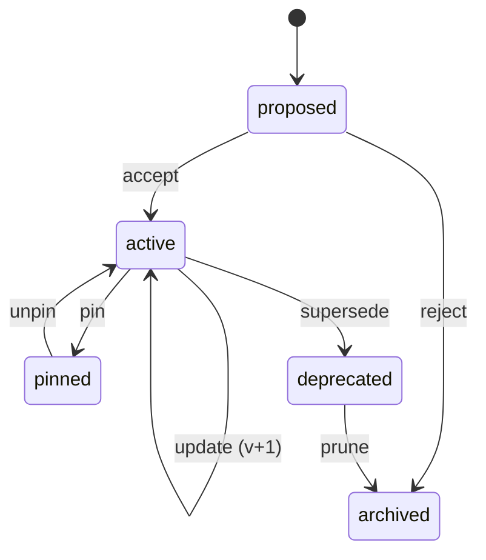

# Versioning

The mesh has **two distinct kinds of versioned artifacts**, and they are versioned very differently.

| Kind | Lives in | Versioned by |
|------|----------|--------------|
| **Platform code** | A git repository (separate from this docs repo) | Git tags, human-managed semver |
| **Dynamic artifacts** | The application database | DB rows with embedded manifests |

This split is deliberate. Platform code changes via PRs and tags. Routines, policies,
and criteria change at runtime — sometimes proposed by the system itself — and need
versioning that is not gated on a deploy.

---

## 1. Platform versioning

- The implementing platform repo uses **semver** with annotated git tags (`v1.2.3`).
- A platform release publishes a **release manifest** referenced by `release_manifest_id` in every Task created on that release.
- Major bumps are required for incompatible Task-contract changes.

---

## 2. Dynamic artifacts

The dynamic artifacts are:

| Artifact | Purpose |
|----------|---------|
| **Routine** | A reusable execution pattern: prompt, decomposition shape, tool sequence, expected outputs. |
| **Policy** | A governance rule. See [governance.md](governance.md). |
| **Criterion (suite)** | An evaluation rule. See [evaluator.md](evaluator.md). |
| **Tool plan** | A per-tenant bundle of allowed tools, tiers, and credential aliases. See [tool-plans.md](tool-plans.md). |
| **Prompt template** | The system/user prompts used by routines and agents. Versioned independently because prompt iteration is high-frequency. |

Each is stored as a row keyed by `(artifact_id, version)` with a `status` field and an
embedded **manifest** describing what it depends on.

---

## 3. Routines

A routine is the most "code-like" of the dynamic artifacts.

| Field | Description |
|-------|-------------|
| `routine_id`, `version` | Identity. |
| `title`, `intent` | Human description. |
| `entrypoint_shape` | What inputs this routine expects. |
| `decomposition` | Wave plan template (may be parametric). |
| `tool_intents` | Declared tools required, with tier requirements. |
| `output_schema` | Expected output shape. |
| `prompt_refs` | Pinned prompt template versions. |
| `policy_refs` | Required policy versions. |
| `evaluator_refs` | Default criteria suite. |
| `status` | `proposed`, `active`, `pinned`, `deprecated`, `archived`. |
| `provenance` | Origin (handwritten, distilled-from-task, evaluator-proposed, imported). |

A populated example is in [`examples/routine.example.yaml`](../examples/routine.example.yaml).

### 3.1 Routine lifecycle operations

The full set of supported operations:

| Op | Effect |
|----|--------|
| **create** | Persist a new routine in `proposed` status. |
| **recall** | Resolve a routine by id (and optionally version or pinned label). |
| **update** | Create version *n+1*. The previous version is `deprecated` but remains resolvable for historical Tasks. |
| **pin** | Mark a specific version as the resolved choice for a scope (tenant, routine_id, or label). New Tasks resolving this routine get the pinned version even if newer ones exist. |
| **copy** | Duplicate to another scope (tenant, label, or as a starting point for a derivative routine). Copy carries provenance pointing at the source. |
| **deprecate** | Stop offering as a default; still resolvable by past Tasks. |
| **archive** | Final state. Read-only, not offered to planner. |
| **prune** | A guarded background job that archives unused routine versions older than a configured age. Never deletes; archival floor stands. |

---

## 4. Release manifests

A **release manifest** is the pinning record. Every Task carries a `release_manifest_id` — that ID resolves to *exactly* which version of every dependency the Task runs against.

A release manifest pins:

| Pinned | Why |
|--------|-----|
| Platform git tag | Source of executor, validator, orchestrator code. |
| Task contract version | Ensures schema compatibility. |
| Policy versions in scope | Stable enforcement during the Task's lifetime. |
| Prompt template versions | Stable agent behavior. |
| Routine version (if applicable) | Stable workflow. |
| Tool plan version | Stable tool allow-list. |
| Evaluator criteria suite version | Stable evaluation. |

A populated example is in [`examples/release-manifest.example.yaml`](../examples/release-manifest.example.yaml).

### 4.1 Resolution

When a Task is created:

1. The Orchestrator resolves the **default release manifest** for the tenant.
2. Any per-routine pins override matching elements.
3. The resolved `release_manifest_id` is written to the Task and is immutable.
4. Long-running Tasks may run side-by-side under a second manifest — see [orchestration.md §5.2](orchestration.md).

---

## 5. Why DB-persistence for routines (and not git)

- Routines are proposed and updated at runtime, sometimes by the Evaluator. A deploy gate would block the feedback loop.
- Multi-tenant scopes mean the same logical routine often diverges per client. Git would force a branch explosion.
- Routines need to be queryable: "show me every Task that ran routine X v3 last month" is a SQL query, not a git command.

Platform code does not have these properties, so it stays in git.

---

## 6. Backwards compatibility rules

- Adding a field to a routine's `output_schema` is backwards-compatible only if optional. Removing a field is breaking.
- A breaking change requires `update` (new version), not in-place edit.
- In-place edits are forbidden by the persistence layer; all writes are new rows.
- Past Tasks always resolve their pinned version. There is no "live latest".
